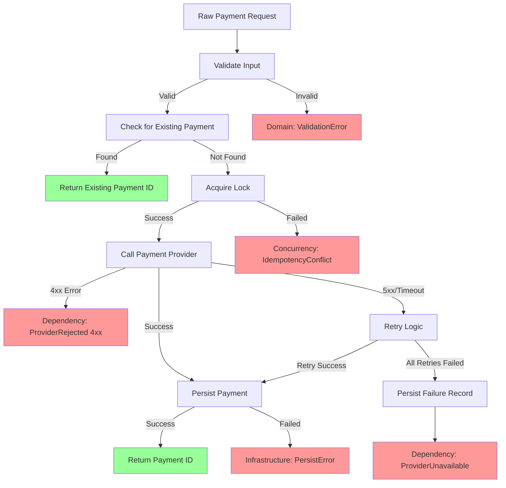
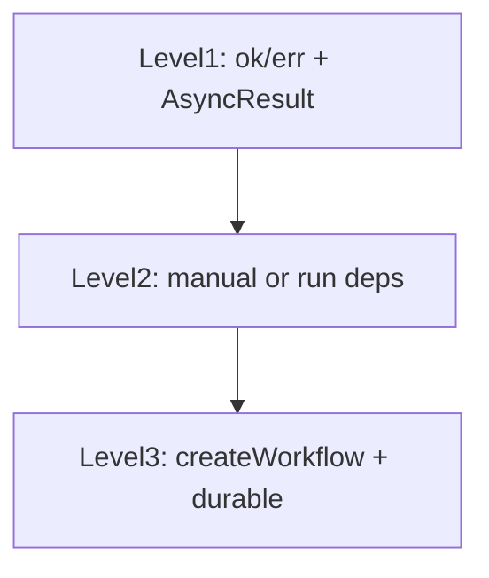
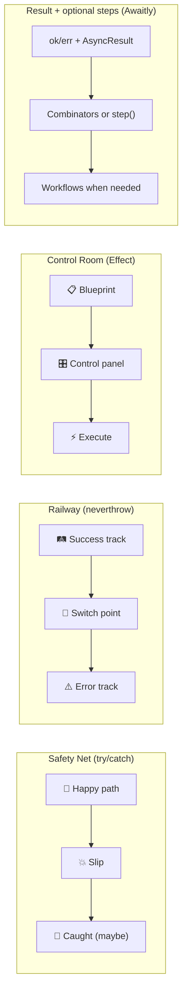
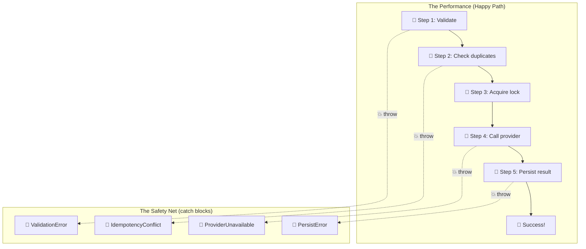
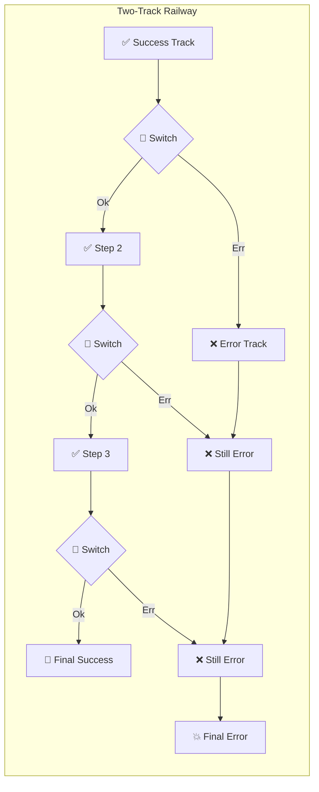
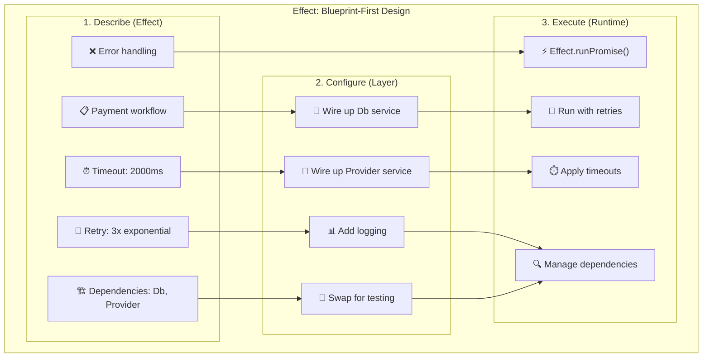
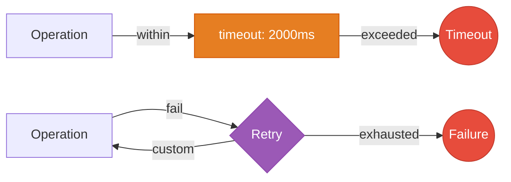
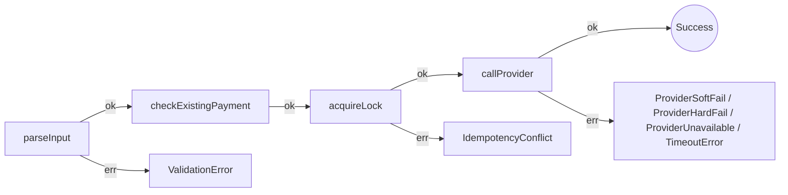
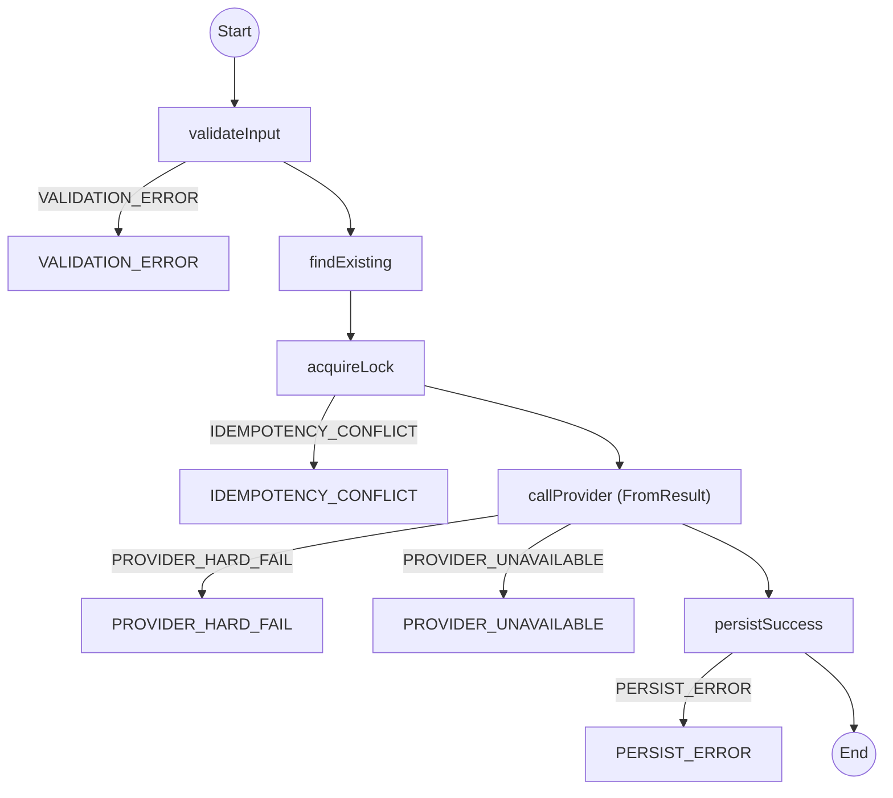
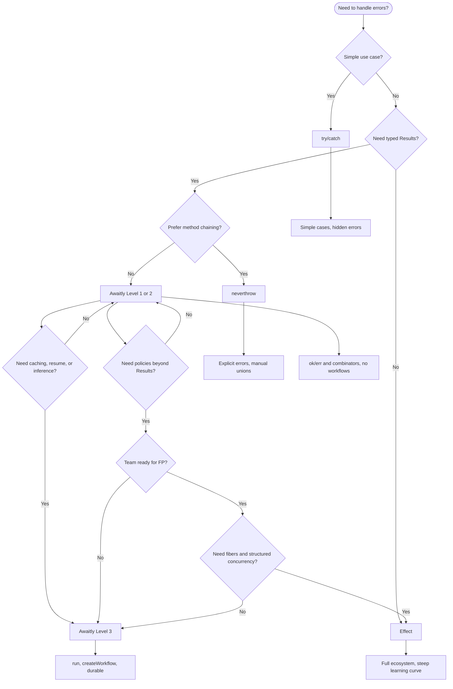

# Beyond Railway-Oriented Programming: Four Practical Error-Handling Styles

**Or: How I learned to stop worrying and embrace failure**

Software fails. Your database goes down mid-transaction, the payment provider times out, and someone types "banana" into a field you assumed held a number.

For years I handled errors one way: ignore them until one shows up drunk at the family reunion and ruins everything. Treat errors as values instead, and failure becomes another path through your code rather than a derailment.

## The Problem: Building a Payment System That Won't Bankrupt You

You're building a payment system that handles real money. It cannot lose a penny or charge anyone twice.

Each step fails in its own way, so start by classifying them:

1.  **Domain Errors** (e.g., `ValidationError`): Invalid user input like `{amount: "banana"}`. You expect these and give the caller clear feedback.
2.  **Concurrency Errors** (e.g., `IdempotencyConflict`): A mobile app retries 47 times and hits a race condition. You need locking or deduplication.
3.  **Dependency Errors** (e.g., `ProviderUnavailable`, `Timeout`): The payment provider is having a bad day. You retry or fail over.
4.  **Infrastructure Errors** (e.g., `PersistError`, `DatabaseError`): Your own database fell over. Someone gets paged.
5.  **Unexpected Errors** (e.g., Bugs): The `undefined is not a function` special.

The four approaches diverge here. You are picking between exception-based handling, explicit Result-based handling, and Results with orchestration and policies layered on top.

(Some errors straddle categories. A provider 4xx is a dependency error, but business logic often treats it as a domain-level hard fail.)

**Three criteria to judge any approach**

1.  **Visible**: Can you see every way the code fails by reading it?
2.  **Composable**: Do errors make functions painful to combine?
3.  **Honest**: Do your signatures tell the truth about what might happen?

You trade local ergonomics against consistency and visibility across the codebase.


```mermaid
graph TD
    A[Raw Payment Request] --> B[Validate Input]
    B -->|Valid| C[Check for Existing Payment]
    B -->|Invalid| X1[Domain: ValidationError]

    C -->|Found| D[Return Existing Payment ID]
    C -->|Not Found| E[Acquire Lock]

    E -->|Success| F[Call Payment Provider]
    E -->|Failed| X2[Concurrency: IdempotencyConflict]

    F -->|Success| G[Persist Payment]
    F -->|4xx Error| X3[Dependency: ProviderRejected 4xx]
    F -->|5xx/Timeout| H[Retry Logic]

    H -->|Retry Success| G
    H -->|All Retries Failed| I[Persist Failure Record]
    I --> X4[Dependency: ProviderUnavailable]

    G -->|Success| J[Return Payment ID]
    G -->|Failed| X5[Infrastructure: PersistError]

    style X1 fill:#ff9999
    style X2 fill:#ff9999
    style X3 fill:#ff9999
    style X4 fill:#ff9999
    style X5 fill:#ff9999
    style J fill:#99ff99
    style D fill:#99ff99
```

## At a Glance: Practical Comparison

All four approaches model the same payment workflow, and a shared test suite in this repo exercises every implementation.

| Approach | Error Visibility | Composability | Ergonomics | Streaming | Functional | Type-Safe Fetch | Lint Plugin |
|----------|-----------------|---------------|------------|-----------|------------|-----------------|---------------|
| **Vanilla (try/catch)** | Low (hidden) | Medium (wraps) | High | Manual | Manual | Manual | - |
| **Neverthrow** | High | High | High (chains) | Manual | Manual | Manual | ✓ |
| **Effect** | Very High | Very High | Low → Medium | ✓ Stream | ✓ pipe/flow | ✓ HttpClient | ✓ |
| **Awaitly** | High | High | High (async/await) | ✓ Streaming | Result combinators | Native fetch + `tryAsync` | ✓ |

**Key differences:**

- **Vanilla**: Fastest to write. Errors hide in the signature.
- **Neverthrow**: Typed Results with method chaining.
- **Effect**: The largest ecosystem (DI, layers, scheduling, tracing, streams) and the steepest learning curve.
- **Awaitly**: Typed Results with the same `ok`/`err` model as neverthrow, kept in async/await. Workflows, caching, and policies stay optional.

## What You Pay For

Awaitly ships four entry points, sets `sideEffects: false`, and has one runtime dependency: `@opentelemetry/api`, added in 4.5 for built-in tracing, which no-ops until you register a provider. Your bundler drops whatever you skip. Measured with esbuild 0.28 (`--bundle --minify`, ESM), importing only what each line names:

| Import | Minified | Gzipped |
|--------|----------|---------|
| `awaitly/result` (`ok`, `err`) | 3.7 KB | **1.34 KB** |
| `neverthrow` (`ok`, `err`) | 6.6 KB | 1.99 KB |
| `awaitly` (Results, `run`, `createWorkflow`, `tryAsync`, `allAsync`) | 64.9 KB | 19.1 KB |
| `effect` (`Effect.succeed` alone) | 81.5 KB | 28.6 KB |

All four are small enough that most apps will never notice, and neverthrow in particular is doing a lot in under 2 KB. The table shows the shape of the curve: you start at 1.34 KB, and the bundle grows the week you import `createWorkflow` because caching has started to matter. About 3.3 KB of the `createWorkflow` line is the OpenTelemetry API that arrived with tracing in 4.5. `awaitly/result` has moved by a few dozen bytes across the 4.x, 5.x and 6.x releases, so the minimal-bundle guarantee holds.

## Awaitly Grows With You

Awaitly stacks optional layers, and you can stop at any of them.

| Level | Import | When |
|-------|--------|------|
| Results only | `awaitly` or `awaitly/result` | Drop-in neverthrow alternative |
| Composition | Manual checks + `ErrorsOf`, or `run(deps, fn)` | Async sequential work without workflows |
| Orchestration | `createWorkflow`, `durable` | Caching, resume, HITL, policies |


```mermaid
flowchart TD
  L1["Level1: ok/err + AsyncResult"] --> L2["Level2: manual or run deps"]
  L2 --> L3["Level3: createWorkflow + durable"]
```

The layers matter because most libraries ask you to commit on day one. Level 1 is a `Result<T, E>` type and two constructors, so you can adopt it in one file and leave the rest of the codebase alone. When one workflow starts needing idempotency keys, you wrap that workflow and nothing else. Your existing Level 1 code keeps compiling.

Migrating from raw promises stays cheap for the same reason. Awaitly returns Results from ordinary `async` functions, so your call sites keep `await` and your team keeps the mental model it already has. Compare the two migrations:

```typescript
// Before: a promise that throws
const user = await fetchUser(id);

// neverthrow: the call site changes shape
const user = await fetchUser(id).match(
  (u) => u,
  (e) => { throw e; },
);

// awaitly: the call site keeps await, and adds one check
const result = await fetchUser(id);
if (!result.ok) return result;
const user = result.value;
```

You convert one function at a time, and the functions you haven't touched still work.

### Version notes

This repo tracks **Awaitly 6.1**. The 4.0 release cut the entry points from thirteen to four:

| Entry | Carries |
|-------|---------|
| `awaitly` | Results, `run`, `createWorkflow`, steps, resources, batching, policies |
| `awaitly/result` | Result primitives only, the minimal-bundle guarantee |
| `awaitly/durable` | Durable execution, persistence, sagas, human-in-the-loop, streaming, webhooks, engine |
| `awaitly/testing` | Test helpers, kept out of production bundles |

The release removed nothing. `awaitly/run` and `awaitly/workflow` folded into `awaitly`, and `awaitly/saga`, `awaitly/hitl`, `awaitly/streaming`, `awaitly/persistence`, `awaitly/webhook`, and `awaitly/engine` folded into `awaitly/durable`. The release treats reaching for `as const`, a cast, or a restated error list as a library problem, so the release removed each one rather than documenting it. See [api-comparison.md §3](./src/comparison/api-comparison.md) for what inferred error unions look like on hover.

**4.1 continues that theme**, and three of its changes show up in this repo's examples:

| Change | What it removes |
|--------|-----------------|
| `errors: ['PARSE_FAILED']` joins the workflow's error union | A `step.try` error that no dep produces used to need all four type parameters of `createWorkflow` spelled out |
| Stream failures arrive as typed values (`STREAM_READ_ERROR`), like `STEP_TIMEOUT` | Infrastructure failures stop disguising themselves as `UnexpectedError`; only your own callback throws stay exceptions |
| Optional options accept `undefined` | `cache: options?.cache` works under `exactOptionalPropertyTypes`, with no conditional spread per field (see `data-pipeline.test.ts`) |

Also in 4.1: `durable.run` accepts a `streamStore`, so durable execution and streaming compose in one call, and `catchUnexpected` keeps a literal tag without `as const`.

**4.2** finishes the job on declared errors. `durable.run` takes `errors` too, so the durable path can name an error its deps never produce, including putting `STREAM_READ_ERROR` in the static union. That is what makes the boundary `switch` in [data-pipeline.md §5](./src/comparison/data-pipeline.md) exhaustive instead of a string comparison.

**4.3** is a DX pass with one change that matters for bundle claims: `StandardSchemaV1` now lives inside the package rather than arriving through `@standard-schema/spec`. The optional peer dependency resolved for nobody, so `pnpm add awaitly` could fail typechecking unless you had `skipLibCheck` on. Awaitly installed with no dependencies at all from that release until 4.5 added `@opentelemetry/api`. Retry options also speak one language across policies and steps (`delay`/`initialDelay`, `retryIf`/`shouldRetry`), invalid attempt counts throw at configuration time, and saga `compensate` accepts a `Result` return so `compensate: (p) => deps.refund(p.id)` needs no wrapper.

**4.4** removes the `as const` tax on error literals. `err()` and the error mappers of `from`, `fromPromise`, `tryAsync`, `fromNullable`, `mapError`, `mapTry`, `mapErrorTry`, and `tryAsyncRetry` now take `const` type parameters, so `err({ type: 'NOT_FOUND', id })` keeps its discriminant instead of widening to `string` and losing exhaustive `switch`. `step.withTimeout` type-checks its timeout error, which before 4.4 never reached the result union. Two breaking changes to know about: inferred error literals now carry `readonly` modifiers, and `Result` dropped its third `cause` parameter, so `Result<T, E, C>` becomes `Result<T, E>`.

**4.5** is the release that changes what this repo can claim about observability. Awaitly emits OpenTelemetry spans on its own, covering runs, steps, retry attempts, parallel and race scopes, sagas, compensations, and queued engine workflows. Each step runs inside its own active span, so spans from a database driver or HTTP client you already instrument nest under the step that made the call. That is the part an `onEvent` bridge could not reach, because a callback fires beside the step rather than inside it. Registering a provider is the whole setup, and without one the calls hit OpenTelemetry's no-op implementation. `AWAITLY_TELEMETRY=0`, `setTelemetryEnabled(false)`, or `telemetry: false` on a run turn it off.

Three more things arrived with it. `TaggedError.toJSON` keeps the discriminant, message, and enumerable props across a wire, and omits the stack so a sender does not leak its file paths. An injectable `Clock` makes retry, sleep, timeout, and circuit-breaker tests deterministic. And `awaitly/error-require-discriminant` joins `recommended-strict`, reporting a class that extends `Error` without a string-literal `type` or `_tag`, since that is what keeps two error classes distinct in an inferred union. This repo turns that rule on for its awaitly code in [`.oxlintrc.json`](./.oxlintrc.json), which loads `eslint-plugin-awaitly` through oxlint's JS plugin support.

Two changes to plan for. Retry no longer retries `UnexpectedError` or untagged throws by default, so a policy that relied on catching a thrown exception needs `retryIf: () => true`; typed errors still retry as before. And `@opentelemetry/api` is now a dependency, which is the 3.3 KB gzipped that the `awaitly` line in the bundle table picked up.

**5.0** makes resume finer-grained. `step.forEach` checkpoints each iteration, so a resumed run skips the items it finished and re-runs the rest, and `step.retry` and `step.withTimeout` checkpoint by id under `durable.run`. A new `resumeFailedSteps` option decides what a resume restores: the default `'crashed'` retries thrown failures and keeps typed errors as decided, and `'all'` restores every failed step. `awaitly/durable` exports the `DurableStore` type that the postgres, mongo, and libsql adapters implement. One thing to check on upgrade: forEach checkpoints written by an earlier version re-run once.

**6.0** has one breaking change. `step.forEach` raises `IterationLimitError` when a collection exceeds `maxIterations`, where it used to truncate in silence; pass `onMaxIterations: 'stop'` to keep the old behaviour. `awaitly/testing` gains `durableStoreContract`, a conformance suite for any store adapter. The lint plugin (now `eslint-plugin-awaitly` 4.0) resolves `step` and `deps` through lexical scopes, so aliased destructuring gets linted, and the `concurrency-no-promise-*` rules only fire inside workflow callbacks.

**6.1** lets `step.retry` and `step.withTimeout` take `errors: [...]`, so a tag produced by a custom handler or attempt joins the static union at the call site. The analyzer reads those helpers inside `step.forEach` too.

See [api-comparison.md](./src/comparison/api-comparison.md) for pattern-by-pattern examples at each level.

## Four Philosophies


```mermaid
graph LR
    subgraph "Safety Net (try/catch)"
        A1["🤹 Happy path"]
        A2["💥 Slip"]
        A3["🥅 Caught (maybe)"]
        A1 --> A2
        A2 --> A3
    end

    subgraph "Railway (neverthrow)"
        B1["🛤️ Success track"]
        B2["🚦 Switch point"]
        B3["⚠️ Error track"]
        B1 --> B2
        B2 --> B3
    end

    subgraph "Control Room (Effect)"
        C1["📋 Blueprint"]
        C2["🎛️ Control panel"]
        C3["⚡ Execute"]
        C1 --> C2
        C2 --> C3
    end

    subgraph "Result + optional steps (Awaitly)"
        D1["ok/err + AsyncResult"]
        D2["Combinators or step()"]
        D3["Workflows when needed"]
        D1 --> D2
        D2 --> D3
    end
```

### 🎭 The Optimist (try/catch)

"Everything will work fine... oh crap, something broke, quick, catch it!"

You already know this one. Write the code assuming it works, and when reality intrudes, let the exception bubble up until something catches it.

```typescript
async function makePayment(data: unknown) {
  try {
    // Assume everything works perfectly
    const payment = validatePayment(data);
    const result = await chargeCustomer(payment);
    await saveToDatabase(result);
    return { success: true };
  } catch (error) {
    // In core logic: convert/rethrow. Log at the system boundary to avoid double-logging.
    throw error;
  }
}
```

In production code, "convert" tends to mean mapping unknown exceptions into a typed `InfrastructureError` at the boundary:

```typescript
app.post('/pay', async (req, res) => {
  try {
    const result = await makePayment(req.body);
    res.json(result);
  } catch (e) {
    const err = AppError.fromUnknown(e);
    res.status(err.httpStatus).json({ error: err.message });
  }
});
```

**The Mental Model: The Trapeze Artist**

You're flying through the air doing acrobatics, focused on the timing, the catches, and the applause. If something goes wrong, there's a safety net down there somewhere. Simplicity is the whole appeal here, and you pay for it as the code grows.


```mermaid
flowchart TD
    subgraph "The Performance (Happy Path)"
        P1["🤹 Step 1: Validate"]
        P2["🤹 Step 2: Check duplicates"]
        P3["🤹 Step 3: Acquire lock"]
        P4["🤹 Step 4: Call provider"]
        P5["🤹 Step 5: Persist result"]
        P6["🎉 Success!"]
        P1 --> P2 --> P3 --> P4 --> P5 --> P6
    end

    subgraph "The Safety Net (catch blocks)"
        N1["🥅 ValidationError"]
        N2["🥅 IdempotencyConflict"]
        N3["🥅 ProviderUnavailable"]
        N4["🥅 PersistError"]
    end

    P1 -."💥 throw".-> N1
    P2 -."💥 throw".-> N2
    P4 -."💥 throw".-> N3
    P5 -."💥 throw".-> N4
```

**When to use this:**

Reach for try/catch on simple operations, during prototyping, and at system boundaries like HTTP handlers and event listeners, where you catch whatever went wrong and return a status code.

**The limitations:**

**Signatures hide failure modes**

The signature says `Promise<{paymentId: string}>` and conceals five error types. You find the missing handler in production.

**The happy path scatters**

Defensive try/catch blocks interrupt the success flow, so following the business logic means jumping between the two.

**No static analysis of error paths**

TypeScript cannot verify you handled every case. Forget one and the compiler says nothing. The pager tells you instead.

**Composition breaks down**

Calling this from another function means wrapping it in another try/catch, and each layer of abstraction adds one more.

try/catch works well at system boundaries: HTTP controllers, event handlers, that sort of thing. In core business logic it's like doing surgery with oven mitts.

---

### 🚂 The Realist (neverthrow)

"Half of everything breaks, so let's plan for that from the start"

Put failure in the signature and the compiler starts helping you. Railway-Oriented Programming gives you two tracks from the beginning: one for success, one for failure.

```typescript
import { Result, ok, err } from 'neverthrow';

async function makePayment(
  data: unknown
): Promise<Result<PaymentSuccess, PaymentError>> {
  const validationResult = validatePayment(data);
  if (validationResult.isErr()) {
    return err(validationResult.error); // Stop here, pass the error along
  }

  const chargeResult = await chargeCustomer(validationResult.value);
  if (chargeResult.isErr()) {
    return err(chargeResult.error); // Something went wrong, but we handle it gracefully
  }

  // Only continue if everything is OK
  return ok({ success: true });
}
```

**The Mental Model: Two Tracks, One Journey**

Every function hands you a train sitting on one of two tracks. It carries a `Result<Success, Error>`:

- `Ok(value)`: "All good, staying on the success track"
- `Err(error)`: "Something went wrong, switching to the error track"


```mermaid
flowchart LR
    subgraph "Two-Track Railway"
        S1["✅ Success Track"]
        S2["✅ Step 2"]
        S3["✅ Step 3"]
        S4["🎉 Final Success"]

        E1["❌ Error Track"]
        E2["❌ Still Error"]
        E3["❌ Still Error"]
        E4["💥 Final Error"]

        SW1{"🚦 Switch"}
        SW2{"🚦 Switch"}
        SW3{"🚦 Switch"}

        S1 --> SW1
        SW1 -->|"Ok"| S2
        SW1 -->|"Err"| E1

        S2 --> SW2
        SW2 -->|"Ok"| S3
        SW2 -->|"Err"| E2

        S3 --> SW3
        SW3 -->|"Ok"| S4
        SW3 -->|"Err"| E3

        E1 --> E2 --> E3 --> E4
    end
```

Once you're on the error track you stay there until you handle it.

**When to use this:**

Pick neverthrow when your business logic has several failure modes that need different treatment, or when you want error-handling discipline the compiler enforces.

**Why this works better:**

**Signatures tell the truth**

`Promise<Result<{paymentId: string}, PaymentError>>` tells you what you're getting: a payment ID or an error. The type system puts error handling in the signature where you can see it.

**Composition reads as a pipeline**

```typescript
return parse(raw)
  .andThen((input) => checkExisting(db, input))
  .andThen((input) => acquireLock(db, input))
  .andThen((input) => callProvider(provider, input))
  .andThen((response) => persistSuccess(db, input, response))
  .orElse((error) => handleSpecificErrors(error));
```

Each step passes its result to the next or jumps to the error handler.

**Reaching for `safeTry` on longer flows**

Method chaining reads well up to about four steps. Past that, keeping earlier values in scope pushes you into nesting, and this repo's `checkoutNeverthrow` sits three levels deep for six steps. neverthrow anticipated this and ships `safeTry`, which uses generators to flatten the same flow. If you hit the nesting, that's the tool to reach for.

**Errors are data**

You get error values you can inspect, transform, and reason about instead of exceptions in flight. Logging validation errors one way and database errors another takes a `switch`. Retrying only certain error types takes a predicate.

**How Awaitly compares here**

Honest signatures, composition, and errors-as-data apply to Awaitly the same way. Both libraries implement railway-oriented programming with Result types, and at Level 1 the two are near-identical in size and shape:

```typescript
// neverthrow
import { ok, err, Result } from 'neverthrow';
const parse = (raw: string): Result<Payment, 'INVALID'> =>
  isValid(raw) ? ok(toPayment(raw)) : err('INVALID');

// awaitly
import { ok, err, type Result } from 'awaitly';
const parse = (raw: string): Result<Payment, 'INVALID'> =>
  isValid(raw) ? ok(toPayment(raw)) : err('INVALID');
```

Two differences follow from that. Awaitly reads results as plain properties (`result.ok`, `result.value`) rather than through `.isOk()` methods, so a Result survives `JSON.stringify` and crosses a worker boundary intact. And for multi-step flows, where neverthrow offers `.andThen()` chains and `safeTry`, Awaitly keeps you in async/await through `run(deps, fn)` or `step()`. Both get you to the same place, so pick the one that matches how your team already writes code.

---

### 🏗️ The Architect (Effect)

"Let's describe exactly what should happen, then let the system figure it out"

You write code that describes what should happen and hand the description to a runtime. Timeouts, retries, logging, and dependency injection become policies you declare up front rather than statements scattered through the body.

```typescript
import { Effect } from 'effect';

// (Assume validatePayment/chargeCustomer/saveToDatabase return Effect values, not promises.)

const makePayment = (data: unknown) =>
  Effect.gen(function* () {
    const payment = yield* validatePayment(data);
    const result = yield* chargeCustomer(payment);
    yield* saveToDatabase(result);
    return { success: true };
  }).pipe(
    Effect.timeout(5000),
    Effect.withLogSpan('payment')
  );
```

**The Mental Model: The Blueprint Factory**

You design a factory and build none of it. You produce detailed blueprints specifying:

- What machines you need (dependencies)
- How long each process should take (timeouts)
- What to do when machines break (retries, circuit breakers)
- How the pieces fit together (composition)
- What should be logged and when (observability)

You can test the blueprint without building the factory, swap machine specifications without redrawing it, and simulate failures to watch how the system responds.


```mermaid
flowchart TD
    subgraph "Effect: Blueprint-First Design"
        subgraph "1. Describe (Effect)"
            B1["📋 Payment workflow"]
            B2["⏰ Timeout: 2000ms"]
            B3["🔄 Retry: 3x exponential"]
            B4["🏗️ Dependencies: Db, Provider"]
            B5["❌ Error handling"]
        end

        subgraph "2. Configure (Layer)"
            L1["🔌 Wire up Db service"]
            L2["🔌 Wire up Provider service"]
            L3["📊 Add logging"]
            L4["🧪 Swap for testing"]
        end

        subgraph "3. Execute (Runtime)"
            R1["⚡ Effect.runPromise()"]
            R2["🎯 Run with retries"]
            R3["⏱️ Apply timeouts"]
            R4["🔍 Manage dependencies"]
        end

        B1 --> L1
        B2 --> L2
        B3 --> L3
        B4 --> L4
        B5 --> R1

        L1 --> R2
        L2 --> R3
        L3 --> R4
        L4 --> R4
    end
```

Then you hand the blueprint to a runtime engineer who builds and operates the factory.

**When to use this:**

Choose Effect when you need orchestration patterns like retries, timeouts, and circuit breakers across the whole application, when swappable services drive your testing strategy, or when your team has room to learn functional programming concepts.

**Why you might want this:**

**Policies become first-class**

Declare exponential backoff once and reuse it:

```typescript
// (Imports omitted for brevity: Schedule, Layer, etc.)

const retryPolicy = Schedule.exponential(200).pipe(
  Schedule.jittered, // Add randomness to avoid thundering herd
  Schedule.recurs(3) // Maximum 3 retries
);

const program = callProvider.pipe(
  Effect.timeout(2000), // Timeout policy
  Effect.retry(retryPolicy) // Retry policy
);
```

Because the policy is data in the pipe, `pnpm analyze:effect` reads it back out. This is the analyzer's drawing of `callProvider` in [`effect-version.test.ts`](./src/effect-version.test.ts):


```mermaid
flowchart LR
  N0_Op[Operation] -->|within| N0_T[timeout: 2000ms]
  N0_T -->|exceeded| N0_Fail((Timeout))
  N1_Op[Operation] -->|fail| N1_R{Retry}
  N1_R -->|"custom"| N1_Op
  N1_R -->|exhausted| N1_Fail((Failure))
  style N0_T fill:#e67e22,stroke:#d35400,color:#fff
  style N0_Fail fill:#e74c3c,stroke:#c0392b,color:#fff
  style N1_R fill:#9b59b6,stroke:#8e44ad,color:#fff
  style N1_Fail fill:#e74c3c,stroke:#c0392b,color:#fff
```

And the same tool draws the whole `createPaymentEffect` program as a railway, with the error channel of each step on the `err` edges:


```mermaid
flowchart LR
  A["parseInput"] -->|ok| B["checkExistingPayment"]
  B -->|ok| C["acquireLock"]
  C -->|ok| D["callProvider"]
  D -->|ok| Done((Success))
  A -->|err| AE["ValidationError"]
  C -->|err| CE["IdempotencyConflict"]
  D -->|err| DE["ProviderSoftFail / ProviderHardFail / ProviderUnavailable / TimeoutError"]
```

**Testing swaps the world, not the program**

```typescript
// Production: real database, real payment provider
const prodLayer = Layer.merge(DbService.live, ProviderService.live);

// Testing: fake everything
const testLayer = Layer.merge(DbService.test, ProviderService.mock);

// Same program runs in both environments
await Effect.runPromise(program.pipe(Effect.provide(testLayer)));
```

**Everything composes the same way**

One retry policy, one error-handling style, application-wide. Adding tracing once gives you tracing everywhere.

**What adopting Effect asks of you**

Effect is a runtime rather than a library, so it rewards commitment: the value compounds as more of your call graph moves into it. Plan the adoption rather than sprinkling it, and you get a great deal back.

If you start today: v4 has reached release candidate, and this repo's Effect examples typecheck against `effect@4.0.0-rc.112`. Getting here took real edits. `Effect.catchAll` became `Effect.catch`, `Effect.timeoutFail` went away in favour of `timeout` plus `mapError`, `Schedule.intersect` and `Schedule.whileInput` moved into the options object on `Effect.retry`, and `Cause` stopped exposing `_tag` and `error` on the value. Those are the shape of changes a pre-1.0 line asks for, and the rc series has been quiet by comparison: beta.107 to rc.112 needed no source changes here. Pin your version and read the changelog on each bump.

---

### 🎼 Awaitly (Results first, workflows optional)

Awaitly starts as a Result library. Each function returns `ok(value)` or `err(error)`, with no workflow wrapper.

**Level 1: plain Results**

```typescript
import { ok, err, type AsyncResult } from 'awaitly';

const validatePayment = async (data: unknown): AsyncResult<Payment, ValidationError> =>
  isValid(data) ? ok(parsePayment(data)) : err(new ValidationError('Invalid'));

const chargeCustomer = async (payment: Payment): AsyncResult<ChargeResult, PaymentError> =>
  ok({ success: true });

const saveToDatabase = async (result: ChargeResult): AsyncResult<void, DatabaseError> =>
  ok(undefined);
```

That is the whole of Level 1, and it costs 1.34 KB gzipped from `awaitly/result`. Stop here if it covers you.

**Level 2: composition with manual checks (or sync combinators)**

```typescript
import { ok, type AsyncResult, type ErrorsOf } from 'awaitly';

const deps = { validatePayment, chargeCustomer, saveToDatabase };
type PaymentErrors = ErrorsOf<typeof deps>;

const processPayment = async (
  data: unknown,
): AsyncResult<{ success: true }, PaymentErrors> => {
  const paymentResult = await deps.validatePayment(data);
  if (!paymentResult.ok) return paymentResult;

  const chargeResult = await deps.chargeCustomer(paymentResult.value);
  if (!chargeResult.ok) return chargeResult;

  const saveResult = await deps.saveToDatabase(chargeResult.value);
  if (!saveResult.ok) return saveResult;

  return ok({ success: true as const });
};
```

Sync `andThen` and `map` apply to sync `Result` values, where the callback returns `Result` rather than `AsyncResult`.

**Level 3: `run(deps, fn)` for early exit without manual checks**

```typescript
import { run } from 'awaitly';

const result = await run(
  { validatePayment, chargeCustomer, saveToDatabase },
  async (s) => {
    const payment = await s.validatePayment(data);
    const charge = await s.chargeCustomer(payment);
    await s.saveToDatabase(charge);
    return { success: true };
  },
);

// result.error: ValidationError | PaymentError | DatabaseError | UnexpectedError
```

Reach for `createWorkflow()` when you need caching, resume state, or named production workflows:

```typescript
import { createWorkflow } from 'awaitly';

// Declare dependencies → error union computed automatically
const makePayment = createWorkflow('makePayment', { validatePayment, chargeCustomer, saveToDatabase });

const result = await makePayment.run(async ({ step, deps }) => {
  const payment = await step('validatePayment', () => deps.validatePayment(data), { key: 'validate' }); // Cached
  const charge = await step('chargeCustomer', () => deps.chargeCustomer(payment), { key: 'charge' });
  await step('saveToDatabase', () => deps.saveToDatabase(charge), { key: 'save' });
  return { success: true };
});

// result.error: ValidationError | PaymentError | DatabaseError | UnexpectedError
// ↑ Computed automatically from { validatePayment, chargeCustomer, saveToDatabase }
```

**Why caching and resume matter for payments**

If the provider charge succeeds and persistence fails, a naive retry charges the customer twice. Step keys let you resume without repeating side effects.

```typescript
const makePayment = createWorkflow('makePayment', { validatePayment, callProvider, persistSuccess });

const result = await makePayment.run(async ({ step, deps }) => {
  const payment = await step('validatePayment', () => deps.validatePayment(data), { key: 'validate' });

  // Never repeat this once it succeeds:
  const charge = await step('callProvider', () => deps.callProvider(payment), {
    key: `charge:${payment.idempotencyKey}`,
  });

  // If this fails (DB down), you can rerun later and resume here without re-charging:
  await step('persistSuccess', () => deps.persistSuccess(payment, charge), { key: `persist:${charge.id}` });

  return { paymentId: charge.paymentId };
});
```

The full version of that workflow lives in [`workflow-version.test.ts`](./src/workflow-version.test.ts), and `pnpm analyze:awaitly` draws it from the source. You never redraw it:


```mermaid
flowchart TB


  start((Start))
  step_1["validateInput"]
  err_step_1_VALIDATION_ERROR["VALIDATION_ERROR"]
  step_2["findExisting"]
  step_3["acquireLock"]
  err_step_3_IDEMPOTENCY_CONFLICT["IDEMPOTENCY_CONFLICT"]
  step_4["callProvider (FromResult)"]
  err_step_4_PROVIDER_HARD_FAIL["PROVIDER_HARD_FAIL"]
  err_step_4_PROVIDER_UNAVAILABLE["PROVIDER_UNAVAILABLE"]
  step_5["persistSuccess"]
  err_step_5_PERSIST_ERROR["PERSIST_ERROR"]
  end_node((End))

  step_1 -->|VALIDATION_ERROR| err_step_1_VALIDATION_ERROR
  step_1 --> step_2
  step_3 -->|IDEMPOTENCY_CONFLICT| err_step_3_IDEMPOTENCY_CONFLICT
  step_2 --> step_3
  step_4 -->|PROVIDER_HARD_FAIL| err_step_4_PROVIDER_HARD_FAIL
  step_4 -->|PROVIDER_UNAVAILABLE| err_step_4_PROVIDER_UNAVAILABLE
  step_3 --> step_4
  step_5 -->|PERSIST_ERROR| err_step_5_PERSIST_ERROR
  step_4 --> step_5
  start --> step_1
  step_5 --> end_node
```

Each step is a node and each error a labelled edge, so the review question "what happens when the lock is held" has an answer before you open the function body.

**When to use each level:**

| Level | API | Use when |
|-------|-----|----------|
| 1 | `ok`/`err`, `AsyncResult` | You want typed errors like neverthrow |
| 2 | Manual checks + `ErrorsOf`, or `run(deps, fn)` | You want composition without workflows |
| 3 | `createWorkflow()`, `durable` | You need caching, resume, or production orchestration |

**Level 2 in one sentence**

Write ordinary async/await code, and bound steps unwrap Results and exit early on error.

```typescript
const result = await run({ fetchUser, fetchPosts }, async (s) => {
  const user = await s.fetchUser('1');
  const posts = await s.fetchPosts(user.id);
  return { user, posts };
});
```

**Early exit comes free**

`step()` unwraps Results and exits on the first error, so you skip the `.isErr()` check after every line and the happy path stays readable.

**Wrap throwing code with step.try()**

For operations that throw, such as third-party APIs, `step.try()` converts exceptions into typed errors:

```typescript
const response = await step.try('riskyOp', () => riskyOperation(), {
  error: 'OPERATION_FAILED', // or a factory: (cause) => ({ type: 'OPERATION_FAILED', message: String(cause) })
});
```

**createWorkflow infers the error union**

Declare your functions and Awaitly computes the union. Add a function and the error type widens. Remove one and TypeScript points at the handler you no longer need.

```typescript
const workflow = createWorkflow('workflow', { fetchUser, fetchPosts, sendEmail });
// Error type: 'NOT_FOUND' | 'FETCH_ERROR' | 'EMAIL_FAILED' | UnexpectedError
// ↑ Computed automatically, no manual union management
```

**Step caching and resume state**

Cache expensive operations by key, and pause and resume workflows. Long-running jobs and human-in-the-loop flows need this.

**Retries and timeouts are built in**

```typescript
// Retry with exponential backoff
const user = await step.retry(
  'fetchUser',
  () => fetchUser(id),
  { attempts: 3, backoff: 'exponential', initialDelay: 100, jitter: true }
);

// Timeout with AbortSignal support
const data = await step.withTimeout(
  'fetch',
  (signal) => fetch(url, { signal }),
  { ms: 5000, signal: true }
);
```

Pre-built policies cover the common cases:

```typescript
import { retryPolicies, timeoutPolicies } from 'awaitly';

const user = await step.retry('fetchUser', () => fetchUser(id), retryPolicies.transient);
```

**Streaming with Results**

`awaitly/durable` exposes Result-aware stream processing:

```typescript
import { createWorkflow } from 'awaitly';
import { createMemoryStreamStore, pipe, map, filter, chunk } from 'awaitly/durable';

// The stream store is a workflow option; step.getReadable() reads from it
const streamStore = createMemoryStreamStore();

const job = createWorkflow('processLines', { saveBatch }, { streamStore });

await job.run(async ({ step, deps }) => {
  const reader = step.getReadable<string>({ namespace: 'input' });

  // Transformers are data-first over async iterables: pipe(source, ...stages)
  const batches = pipe(
    reader,
    (s) => map(s, (line) => line.toUpperCase()),
    (s) => filter(s, (line) => line.length > 0),
    (s) => chunk(s, 100)
  );

  let total = 0;
  for await (const batch of batches) {
    await step('saveBatch', () => deps.saveBatch(batch), { key: `batch:${total}` });
    total += batch.length;
  }

  return { total };
});
```

**Result composition and fetch boundaries**

Awaitly keeps the public surface small. Result combinators such as `map`, `andThen`, and `allAsync` come from `awaitly`, while HTTP calls use the platform's `fetch` wrapped with `tryAsync`, so your application owns its domain error model.

**step.sleep() with Duration Support**

Cancellation-aware delays that read as durations:

```typescript
import { run, seconds, minutes } from 'awaitly';

await run(async ({ step }) => {
  // String duration syntax (ID first, then duration)
  await step.sleep('delay', '5s');
  await step.sleep('delay', '1m 30s');

  // Duration helpers
  await step.sleep('delay', seconds(5));
  await step.sleep('delay', minutes(1));

  // With AbortSignal for cancellation
  const controller = new AbortController();
  await step.sleep('delay', '10s', { signal: controller.signal });

  // With caching
  await step.sleep('delay', '5s', { key: 'rate-limit-delay' });
});
```

---

## Which One Should I Choose?

It depends on what you're building.

### Start with try/catch if:

- You're building something small with straightforward failure handling
- Your team is learning JavaScript and TypeScript fundamentals
- Shipping speed matters more to you than compile-time safety
- You're writing a system boundary such as an HTTP handler or event listener

### Consider neverthrow when:

- Your business logic has failure modes that need different handling
- You want the compiler to check that you handled every case
- You keep forgetting to catch exceptions and finding them in production
- Method chaining suits how your team already writes code

### Look at Effect when:

- You need the full ecosystem: dependency injection, layers, structured concurrency, fibers
- Swappable services drive your testing strategy
- You want one set of policies applied through layers across the application
- Your team has room to learn functional programming concepts and to track v4 while it stabilises

### Consider Awaitly when:

- You want typed Results with `ok`/`err` and nothing else yet (Level 1, 1.34 KB)
- Your team writes async/await and you want to keep it
- You're migrating from promises and want to convert one function at a time
- You need error inference, step caching, or resume later without switching libraries
- You want retries, timeouts, and circuit breakers without adopting Effect's runtime
- Bundle size is a constraint you have to defend

## The Decision Tree


```mermaid
flowchart TD
    Start([Need to handle errors?]) --> Simple{Simple use case?}

    Simple -->|Yes| TryCatch[try/catch]
    Simple -->|No| NeedResults{Need typed Results?}

    NeedResults -->|Yes| PreferChains{Prefer method chaining?}
    NeedResults -->|No| Effect[Effect]

    PreferChains -->|Yes| Neverthrow[neverthrow]
    PreferChains -->|No| AwaitlyL1[Awaitly Level 1 or 2]

    AwaitlyL1 --> NeedOrchestration{Need caching, resume, or inference?}
    NeedOrchestration -->|Yes| AwaitlyL3[Awaitly Level 3]
    NeedOrchestration -->|No| AwaitlyL1

    AwaitlyL1 --> NeedPolicies{Need policies beyond Results?}
    NeedPolicies -->|Yes| TeamReady{Team ready for FP?}
    NeedPolicies -->|No| AwaitlyL1

    TeamReady -->|Yes| NeedFibers{Need fibers and structured concurrency?}
    TeamReady -->|No| AwaitlyL3

    NeedFibers -->|Yes| Effect
    NeedFibers -->|No| AwaitlyL3

    TryCatch --> TryCatchGood["Simple cases, hidden errors"]

    Neverthrow --> NeverthrowGood["Explicit errors, manual unions"]

    AwaitlyL1 --> AwaitlyL1Good["ok/err and combinators, no workflows"]

    AwaitlyL3 --> AwaitlyL3Good["run, createWorkflow, durable"]

    Effect --> EffectGood["Full ecosystem, steep learning curve"]
```

Most production systems mix styles: try/catch at boundaries, explicit Results in core workflows, and policy-driven orchestration where it earns its keep. Mixing is a sign of good judgement rather than indecision, so pick per layer instead of picking once for the whole codebase.

## A Simple Example: Division

```typescript
// throwing approach (caught at the boundary)
function divideThrow(a: number, b: number): number {
  if (b === 0) throw new Error('Division by zero');
  return a / b;
}
```

```typescript
// neverthrow approach
import { Result as NtResult, ok as ntOk, err as ntErr } from 'neverthrow';

function divideNeverthrow(a: number, b: number): NtResult<number, Error> {
  return b === 0 ? ntErr(new Error('Division by zero')) : ntOk(a / b);
}
```

```typescript
// Effect approach
import { Effect } from 'effect';

const divideEffect = (a: number, b: number) =>
  b === 0 ? Effect.fail(new Error('Division by zero')) : Effect.succeed(a / b);
```

```typescript
// Awaitly approach (Level 1: plain Results, no workflow)
import { ok, err, type Result } from 'awaitly';

function divideAwaitly(a: number, b: number): Result<number, Error> {
  return b === 0 ? err(new Error('Division by zero')) : ok(a / b);
}

const result = divideAwaitly(10, 2);
// result.ok ? result.value : result.error

// For multi-step flows, add run() or andThen at Level 2/3. Not required here.
```

The signatures tell four different stories:

- try/catch: `number` (lies about potential failure)
- neverthrow: `Result<number, Error>` (honest about what can happen)
- Effect: `Effect<number, Error, never>` (describes a computation that might fail)
- Awaitly: `Result<number, Error>` (honest types, same as neverthrow at Level 1)

## Seeing the Code Without Running It

Two of the four approaches ship a static analyzer that reads your source with the TypeScript checker and emits diagrams, plain-English walkthroughs, and JSON. `awaitly-analyze` maps a workflow's steps and error edges. `effect-analyze` maps an Effect program's services, error channel, and concurrency, and its project modes report on the whole directory: `--error-channel` counts every error type in `src` and finds programs that widened theirs to `Error`, and `--lint-source` runs a deterministic rule set with baselines and SARIF output.

```bash
pnpm analyze:awaitly   # workflow diagram, generated from the code that runs
pnpm analyze:explain   # plain-English walkthrough of each Effect program
pnpm analyze:audit     # project-wide Effect adoption audit
pnpm analyze:errors    # every error type in src, and where none is handled
pnpm analyze:lint      # deterministic source lints across src
pnpm analyze:check     # CI gate: fail if a diagram is not deterministic
```

Both matter for review (the failure paths show up as labelled edges) and for AI coding assistants (a dozen lines of diagram carry the control flow that would otherwise cost you the whole file in context). See **[static-analysis.md](./src/comparison/static-analysis.md)** for real output from this repo.

## Want to Learn More?

- 📖 **[ADVANCED.md](./ADVANCED.md)** - Implementation details, migration strategies, and performance considerations
- 🔍 **[static-analysis.md](./src/comparison/static-analysis.md)** - Diagrams and docs generated from the source, for humans and AI assistants
- 🔌 **[Integration Guides](./src/integrations/)** - Using Awaitly with Zod, Prisma, React Query, and more
- 💻 **[src/](./src/)** - Working examples of all four approaches
- 🧪 **Run the examples** - `pnpm install && pnpm test`

### Integration Guides

Awaitly works alongside your existing libraries:

| Library | Guide | Description |
| :--- | :--- | :--- |
| **Zod** | [zod.md](./src/integrations/zod.md) | Validation errors → typed Results |
| **Prisma** | [prisma.md](./src/integrations/prisma.md) | Database errors → exhaustive handling |
| **React Query** | [react-query.md](./src/integrations/react-query.md) | Server state with Result types |
| **neverthrow** | [neverthrow-migration.md](./src/integrations/neverthrow-migration.md) | Gradual migration path |

## Choosing

Design for failure before you write the happy path. We all ship bugs, and what experience teaches you is to decide up front what happens when a step falls over, so failure has somewhere to go.

You have a rubric now: **Visible, Composable, Honest**. Pick the trade-off you can live with, and remember that at 3 AM you will want code you can read.

Every option here is a good answer to a real question. try/catch keeps things simple and is the right call more often than library authors like to admit. neverthrow gives you composable typed errors in a small, focused package. Awaitly Level 1 covers the same ground in async/await, with workflows waiting for the day caching or resume starts to matter. Effect gives you an architectural toolkit nothing else on this list can match, if you have room for its runtime.

Choose on purpose, and be kind to whoever reads it next. That might be you at 3 AM.
