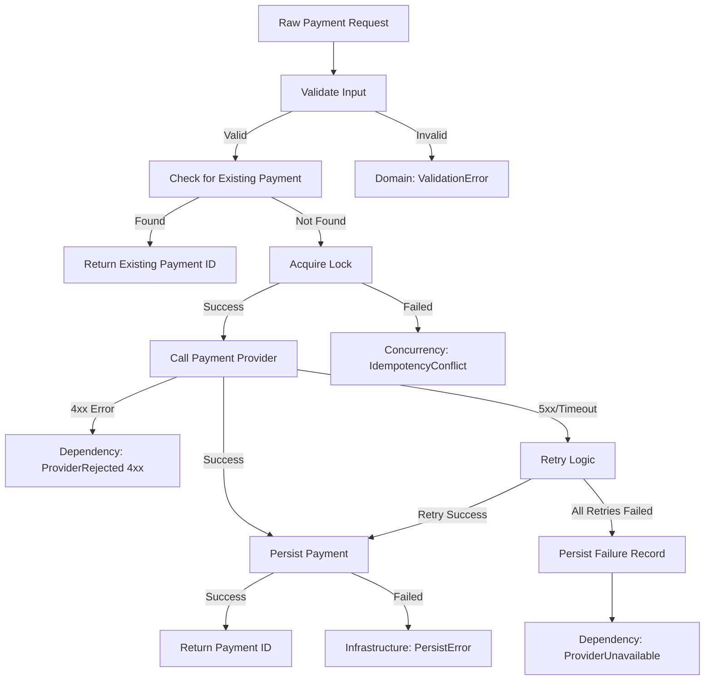
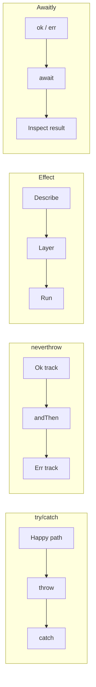
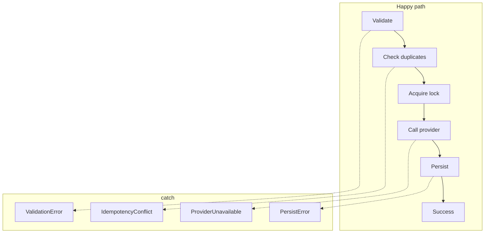
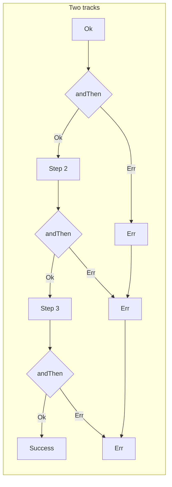
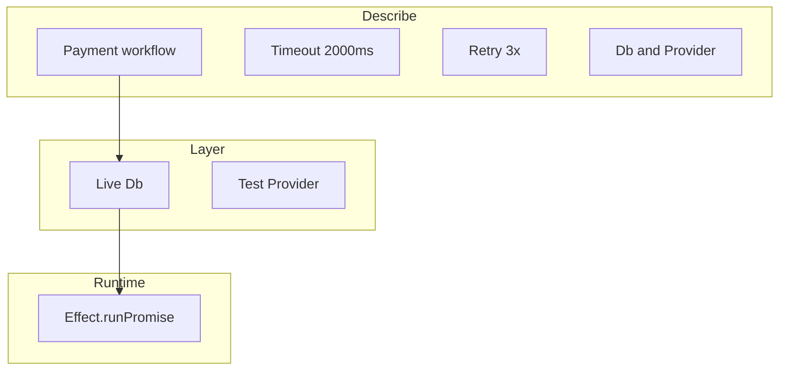
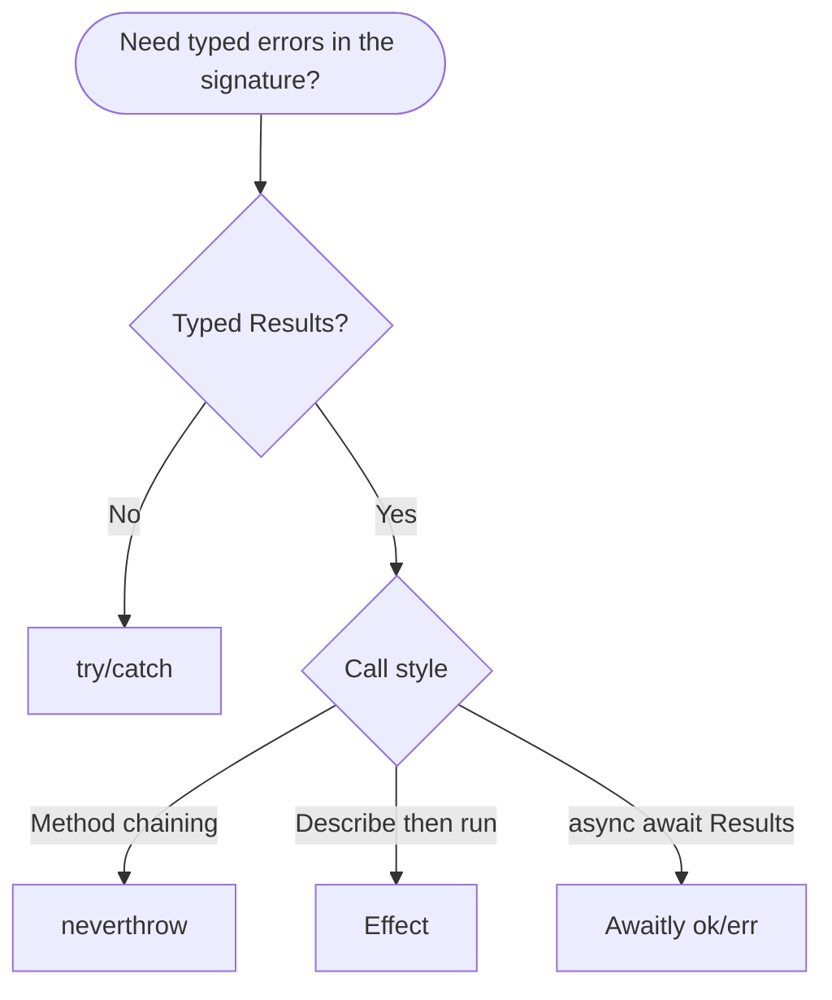

# Four error-handling styles in TypeScript

A payment charge can fail in more than one way. The database can drop mid-transaction. The provider can time out. A caller can send `{amount: "banana"}`. This repo implements the same payment workflow four ways so you can compare how each style puts those failures on the page.

## The payment workflow

You cannot lose a penny or charge anyone twice. Classify the failures before you pick a library:

1. **Domain** (`ValidationError`): `{amount: "banana"}`. Return a clear message.
2. **Concurrency** (`IdempotencyConflict`): a client retries and races a lock.
3. **Dependency** (`ProviderUnavailable`, `Timeout`): the provider is down. Retry or fail over.
4. **Infrastructure** (`PersistError`): your database fell over. Page someone.
5. **Bugs**: `undefined is not a function`. These still throw.

A provider 4xx sits on the dependency boundary. Core logic often treats it as a hard fail.

Judge each approach on two questions you can answer from the source: can you see the failure modes, and does the signature name them? Composing two failing functions is the third.


```mermaid
graph TD
    A[Raw Payment Request] --> B[Validate Input]
    B -->|Valid| C[Check for Existing Payment]
    B -->|Invalid| X1[Domain: ValidationError]

    C -->|Found| D[Return Existing Payment ID]
    C -->|Not Found| E[Acquire Lock]

    E -->|Success| F[Call Payment Provider]
    E -->|Failed| X2[Concurrency: IdempotencyConflict]

    F -->|Success| G[Persist Payment]
    F -->|4xx Error| X3[Dependency: ProviderRejected 4xx]
    F -->|5xx/Timeout| H[Retry Logic]

    H -->|Retry Success| G
    H -->|All Retries Failed| I[Persist Failure Record]
    I --> X4[Dependency: ProviderUnavailable]

    G -->|Success| J[Return Payment ID]
    G -->|Failed| X5[Infrastructure: PersistError]
```


All four implementations live in this repo. A shared test suite runs them.

## At a glance


| Approach       | Visible                  | Honest signature          | Cost                                                                                      |
| -------------- | ------------------------ | ------------------------- | ----------------------------------------------------------------------------------------- |
| **try/catch**  | Hidden in `catch`        | `Promise<T>` omits errors | Built into the language                                                                   |
| **neverthrow** | `Err` in the chain       | `Result<T, E>`            | 1.94 KB gzipped for `ok`/`err`; you write retries                                         |
| **Effect**     | Error channel            | `Effect<A, E, R>`         | A runtime. `Effect.succeed` alone is 27.9 KB gzipped. v4 is an RC.                        |
| **Awaitly**    | `ok: false` on the value | `Result<T, E>`            | 1.31 KB gzipped for `awaitly/result`. Full `awaitly` (run, workflows) is 18.1 KB gzipped. |


try/catch is fastest to type. neverthrow and Awaitly both put `ok`/`err` Results in the signature; neverthrow chains methods, Awaitly stays on async/await. Effect describes a program and runs it later, with layers, fibers, and schedules in the same model.

## Four styles


```mermaid
graph LR
    subgraph trycatch [try/catch]
        A1[Happy path]
        A2[throw]
        A3[catch]
        A1 --> A2
        A2 --> A3
    end

    subgraph neverthrow [neverthrow]
        B1[Ok track]
        B2[andThen]
        B3[Err track]
        B1 --> B2
        B2 --> B3
    end

    subgraph effect [Effect]
        C1[Describe]
        C2[Layer]
        C3[Run]
        C1 --> C2
        C2 --> C3
    end

    subgraph awaitly [Awaitly]
        D1["ok / err"]
        D2[await]
        D3[Inspect result]
        D1 --> D2
        D2 --> D3
    end
```


### try/catch

Write the success path. If something throws, the runtime walks the stack until a `catch` runs.

```typescript
async function makePayment(data: unknown) {
  try {
    const payment = validatePayment(data);
    const result = await chargeCustomer(payment);
    await saveToDatabase(result);
    return { success: true };
  } catch (error) {
    throw error;
  }
}
```

HTTP handlers, event listeners, and other process boundaries still use this. Map the unknown value to a typed error there, then return a status code:

```typescript
app.post('/pay', async (req, res) => {
  try {
    const result = await makePayment(req.body);
    res.json(result);
  } catch (e) {
    const err = AppError.fromUnknown(e);
    res.status(err.httpStatus).json({ error: err.message });
  }
});
```

**Use when** the operation is small, you are prototyping, or you sit at a system boundary.

**Costs:** `Promise<{ paymentId: string }>` hides the five error types. TypeScript will not tell you a handler is missing. Each caller wraps the call in another `try/catch`.


```mermaid
flowchart TD
    subgraph happy [Happy path]
        P1[Validate]
        P2[Check duplicates]
        P3[Acquire lock]
        P4[Call provider]
        P5[Persist]
        P6[Success]
        P1 --> P2 --> P3 --> P4 --> P5 --> P6
    end

    subgraph net [catch]
        N1[ValidationError]
        N2[IdempotencyConflict]
        N3[ProviderUnavailable]
        N4[PersistError]
    end

    P1 -.-> N1
    P2 -.-> N2
    P4 -.-> N3
    P5 -.-> N4
```


---


### neverthrow

Return `ok(value)` or `err(error)`. The compiler tracks the error type. The `ok`/`err` Result shape matches Awaitly.

```typescript
import { Result, ok, err } from 'neverthrow';

async function makePayment(
  data: unknown
): Promise<Result<PaymentSuccess, PaymentError>> {
  const validationResult = validatePayment(data);
  if (validationResult.isErr()) {
    return err(validationResult.error);
  }

  const chargeResult = await chargeCustomer(validationResult.value);
  if (chargeResult.isErr()) {
    return err(chargeResult.error);
  }

  return ok({ success: true });
}
```

Short pipelines read as method chains:

```typescript
return parse(raw)
  .andThen((input) => checkExisting(db, input))
  .andThen((input) => acquireLock(db, input))
  .andThen((input) => callProvider(provider, input))
  .andThen((response) => persistSuccess(db, input, response))
  .orElse((error) => handleSpecificErrors(error));
```

This repo's `checkoutNeverthrow` sits three levels deep for six steps because earlier values must stay in scope. neverthrow ships `safeTry` (generators) to flatten that.

**Use when** business logic has several failure modes and the team already writes method chains.

**Costs:** long flows nest, or you adopt `safeTry`. Retries, timeouts, and resume are yours to write. Gzip for `ok`/`err` is 1.94 KB; Awaitly's Result-only entry (`awaitly/result`) is 1.31 KB.


```mermaid
flowchart LR
    subgraph railway [Two tracks]
        S1[Ok]
        S2[Step 2]
        S3[Step 3]
        S4[Success]
        E1[Err]
        E2[Err]
        E3[Err]
        SW1{andThen}
        SW2{andThen}
        SW3{andThen}

        S1 --> SW1
        SW1 -->|Ok| S2
        SW1 -->|Err| E1
        S2 --> SW2
        SW2 -->|Ok| S3
        SW2 -->|Err| E2
        S3 --> SW3
        SW3 -->|Ok| S4
        SW3 -->|Err| E3
        E1 --> E2 --> E3
    end
```


---


### Effect

You describe a computation. A runtime executes it. Timeouts, retries, logging, and dependency injection are values you attach to that description.

```typescript
import { Effect } from 'effect';

const makePayment = (data: unknown) =>
  Effect.gen(function* () {
    const payment = yield* validatePayment(data);
    const result = yield* chargeCustomer(payment);
    yield* saveToDatabase(result);
    return { success: true };
  }).pipe(
    Effect.timeout(5000),
    Effect.withLogSpan('payment')
  );
```

`validatePayment`, `chargeCustomer`, and `saveToDatabase` return `Effect` values, not promises.

A retry policy is data:

```typescript
const retryPolicy = Schedule.exponential(200).pipe(
  Schedule.jittered,
  Schedule.recurs(3)
);

const program = callProvider.pipe(
  Effect.timeout(2000),
  Effect.retry(retryPolicy)
);
```

Tests swap `Layer` implementations. The program stays the same.

**Use when** you want one policy style across the app, swappable services, or fibers and structured concurrency.

**Costs:** Effect is a runtime. The payoff grows as more of the call graph lives inside it; sprinkling it in one module fights the model. This repo typechecks against `effect@4.0.0-rc.112`. The beta-to-rc jump renamed `catchAll` to `catch`, dropped `timeoutFail`, and moved retry options onto `Effect.retry`. Pin the version. `Effect.succeed` alone is 27.9 KB gzipped.


```mermaid
flowchart TD
    subgraph describe [Describe]
        B1[Payment workflow]
        B2[Timeout 2000ms]
        B3[Retry 3x]
        B4[Db and Provider]
    end

    subgraph configure [Layer]
        L1[Live Db]
        L2[Test Provider]
    end

    subgraph execute [Runtime]
        R1[Effect.runPromise]
    end

    B1 --> L1
    L1 --> R1
```


`pnpm analyze:effect` draws the error channel of `createPaymentEffect` from source. See [static-analysis.md](./src/comparison/static-analysis.md).

---


### Awaitly

Return `ok(value)` or `err(error)`, then `await` the `AsyncResult`. The `ok`/`err` Result shape matches neverthrow. Results are plain objects (`result.ok`, `result.value`), so `JSON.stringify` and worker boundaries keep them intact.

```typescript
import { ok, type AsyncResult, type ErrorsOf } from 'awaitly';

const processPayment = async (
  data: unknown,
): AsyncResult<{ success: true }, ErrorsOf<typeof deps>> => {
  const paymentResult = await deps.validatePayment(data);
  if (!paymentResult.ok) return paymentResult;

  const chargeResult = await deps.chargeCustomer(paymentResult.value);
  if (!chargeResult.ok) return chargeResult;

  const saveResult = await deps.saveToDatabase(chargeResult.value);
  if (!saveResult.ok) return saveResult;

  return ok({ success: true });
};
```

`run(deps, fn)` unwraps those checks. `createWorkflow()` adds named steps, cache keys, and resume. Those APIs are in [ADVANCED.md](./ADVANCED.md) and `[workflow-version.test.ts](./src/workflow-version.test.ts)`.

**Use when** you want typed Results in async/await, and add a workflow wrapper later if you need cache keys or resume.

**Costs:** `createWorkflow` and durable resume are a second surface on top of Results. Gzip is 1.31 KB for `awaitly/result` and 18.1 KB for the full `awaitly` package. Retries and timeouts are step options, not a process-wide Schedule graph. Interop with neverthrow needs a wrapper because neverthrow uses `.isOk()` methods.

---


## Matching the tool to the job

**try/catch.** Small scripts, prototypes, HTTP handlers, event listeners. You accept hidden errors in core logic.

**neverthrow.** Several failure modes, method chaining, a 1.94 KB Result type. You will write retry and resume yourself, or call `safeTry` when chains nest.

**Effect.** Layers, fibers, one Schedule/Layer policy style, a team that will learn the runtime and track v4 while it ships.

**Awaitly.** The same Result model as neverthrow, kept on async/await. 1.31 KB if you import `awaitly/result`. Workflows, cache keys, and durable resume are extra surface, not the default.


```mermaid
flowchart TD
    Start([Need typed errors in the signature?]) --> Typed{Typed Results?}

    Typed -->|No| TryCatch[try/catch]
    Typed -->|Yes| Style{Call style}

    Style -->|Method chaining| Neverthrow[neverthrow]
    Style -->|Describe then run| Effect[Effect]
    Style -->|async await Results| Awaitly[Awaitly ok/err]
```


After that choice, orchestration is a second question on the library you already picked:

- neverthrow: write retry, timeout, and resume as helpers.
- Effect: you already have `Schedule`, `Layer`, and `Stream`.
- Awaitly: add `createWorkflow` / `awaitly/durable` if cache keys or resume show up.

Production code mixes these. try/catch at the process boundary, Results in the domain, policies where a timeout or retry is part of the contract.

## Division, four signatures

```typescript
function divideThrow(a: number, b: number): number {
  if (b === 0) throw new Error('Division by zero');
  return a / b;
}
```

```typescript
import { Result as NtResult, ok as ntOk, err as ntErr } from 'neverthrow';

function divideNeverthrow(a: number, b: number): NtResult<number, Error> {
  return b === 0 ? ntErr(new Error('Division by zero')) : ntOk(a / b);
}
```

```typescript
import { Effect } from 'effect';

const divideEffect = (a: number, b: number) =>
  b === 0 ? Effect.fail(new Error('Division by zero')) : Effect.succeed(a / b);
```

```typescript
import { ok, err, type Result } from 'awaitly';

function divideAwaitly(a: number, b: number): Result<number, Error> {
  return b === 0 ? err(new Error('Division by zero')) : ok(a / b);
}
```

- try/catch: `number`. Failure is a throw.
- neverthrow: `Result<number, Error>`.
- Effect: `Effect<number, Error, never>`. A computation that can fail.
- Awaitly: `Result<number, Error>`. Same Result type as neverthrow.


## Static analysis

Two of the four ship an analyzer that reads TypeScript and prints diagrams. `awaitly-analyze` maps workflow steps and error edges. `effect-analyze` maps services, the error channel, and project-wide lints (`--error-channel`, `--lint-source`).

```bash
pnpm analyze:awaitly   # workflow diagram from the running source
pnpm analyze:explain   # walkthrough of each Effect program
pnpm analyze:audit     # Effect adoption audit
pnpm analyze:errors    # error types in src
pnpm analyze:lint      # source lints
pnpm analyze:check     # fail CI if a diagram is not deterministic
```

Output from this repo: [static-analysis.md](./src/comparison/static-analysis.md).

## More in this repo

- [ADVANCED.md](./ADVANCED.md): full payment implementations, migration, performance numbers
- [static-analysis.md](./src/comparison/static-analysis.md): analyzer output
- [src/](./src/): working examples of all four
- `pnpm install && pnpm test`

The files under [src/integrations/](./src/integrations/) are Awaitly-only notes (Zod, Prisma, React Query, and a neverthrow migration path). They are not a four-way comparison. neverthrow and Effect have their own docs for those stacks.

## Costs, in one place

- **try/catch:** you will miss a `catch`. The type system will not help.
- **neverthrow:** you will write retry, timeout, and resume, or live without them.
- **Effect:** you will learn a runtime and pin a moving v4.
- **Awaitly:** you will add `createWorkflow` and durable APIs the day cache keys or resume matter, and the bundle grows from 1.31 KB to 18.1 KB gzipped.

Pick the cost you can pay. The tests in `src/` show what that looks like on the same payment flow.