# Against Railway-Oriented Programming: Three Ways to Handle the Inevitable

**Or: How I learned to stop worrying and embrace failure**

Here's the thing about software: it fails. Not sometimes. **Always**.

The database decides to take a nap right when you need it. The payment provider goes for a coffee break. The user types "banana" where you expected a number.

Most programmers treat errors like embarrassing relatives, they pretend they don't exist until they show up drunk at the family reunion and ruin everything.

But what if we treated errors as first-class citizens? What if failure was just another path through our code, not a derailment?

## The Problem: Building a Payment System That Won't Bankrupt You

Let's say you're building a payment system. Not a toy one, a real one that handles actual money and can't afford to lose a penny or charge someone twice.

Here's what needs to happen:

1. **Validate input** - Because users will send you `{amount: "banana"}`
2. **Check for duplicates** - Because mobile apps retry everything 47 times
3. **Acquire a lock** - Because concurrent requests exist
4. **Call the provider** - Who might be having a bad day
5. **Persist everything** - With audit trails, because lawyers

Each of these steps fails in its own special way. Validation fails fast with clear messages. The database might be slow but usually works. The payment provider might timeout, return weird HTTP codes, or just say "nope" for reasons known only to them.

This is where our three approaches start to diverge.


## Three Philosophies

**Three ways to think about failure:**

```mermaid
graph LR
    subgraph "Safety Net (try/catch)"
        A1["🚂 Train runs"]
        A2["💥 Derails"]
        A3["🥅 Caught by net"]
        A1 --> A2
        A2 --> A3
    end

    subgraph "Railway (neverthrow)"
        B1["🛤️ Success track"]
        B2["🚦 Switch point"]
        B3["⚠️ Error track"]
        B1 --> B2
        B2 --> B3
    end

    subgraph "Control Room (Effect)"
        C1["📋 Blueprint"]
        C2["🎛️ Control panel"]
        C3["⚡ Execute"]
        C1 --> C2
        C2 --> C3
    end
```



### 🎭 The Optimist (try/catch)

_"Everything will work fine... oh crap, something broke, quick, catch it!"_

This is the approach most developers know and love. Write your code assuming everything will work perfectly. When reality intrudes (and it will), let the exception bubble up until someone, somewhere, catches it.

```typescript
async function makePayment(data: unknown) {
  try {
    // Assume everything works perfectly
    const payment = validatePayment(data);
    const result = await chargeCustomer(payment);
    await saveToDatabase(result);
    return { success: true };
  } catch (error) {
    // Panic! Something went wrong!
    console.error('Uh oh:', error);
    throw error; // Pass the problem to someone else
  }
}
```

**The Mental Model: The Trapeze Artist**

Picture this: You're flying through the air doing complex acrobatics. You're focused on the performance, the timing, the catches, the crowd's applause. If something goes wrong? Well, there's a safety net down there somewhere.

The beauty of this approach is its simplicity. The horror of this approach is also its simplicity.

```mermaid
flowchart TD
    subgraph "The Performance (Happy Path)"
        P1["🤹 Step 1: Validate"]
        P2["🤹 Step 2: Check duplicates"]
        P3["🤹 Step 3: Acquire lock"]
        P4["🤹 Step 4: Call provider"]
        P5["🤹 Step 5: Persist result"]
        P6["🎉 Success!"]
        P1 --> P2 --> P3 --> P4 --> P5 --> P6
    end

    subgraph "The Safety Net (catch blocks)"
        N1["🥅 ValidationError"]
        N2["🥅 IdempotencyConflict"]
        N3["🥅 ProviderUnavailable"]
        N4["🥅 PersistError"]
    end

    P1 -."💥 throw".-> N1
    P2 -."💥 throw".-> N2
    P4 -."💥 throw".-> N3
    P5 -."💥 throw".-> N4
```



**Good for:** Simple cases, getting started quickly  
**Not so good for:** Complex business logic, when you need to handle different errors differently

**Why this feels wrong (sometimes):**

**The function signature lies.** It says `Promise<{paymentId: string}>` but what it really means is `Promise<{paymentId: string} | ExplosiveError>`. You won't know about those 5 different ways it can fail until runtime teaches you the hard way.

**The happy path is interrupted by reality.** Try following the success story through the code. Good luck, it's scattered between try/catch blocks like a Where's Waldo puzzle.

**The compiler won't help you.** Forget to catch an error? The TypeScript compiler shrugs and wishes you luck. You'll discover your mistake at 3 AM when the payments are down.

Don't get me wrong, this approach works great at system boundaries. HTTP controllers, event handlers, that sort of thing. But in your core business logic? It's like doing surgery with oven mitts.

---

### 🚂 The Realist (neverthrow)

_"Half of everything breaks, so let's plan for that from the start"_

Here's a radical idea: what if failure wasn't a surprise? What if your functions were honest about what could go wrong, and the compiler actually helped you handle it?

This is the world of Railway-Oriented Programming. Instead of pretending everything will work and then panicking when it doesn't, we build two tracks from the start: the success track and the failure track.

```typescript
import { Result, ok, err } from 'neverthrow';

async function makePayment(
  data: unknown
): Promise<Result<PaymentSuccess, PaymentError>> {
  const validationResult = validatePayment(data);
  if (validationResult.isErr()) {
    return err(validationResult.error); // Stop here, pass the error along
  }

  const chargeResult = await chargeCustomer(validationResult.value);
  if (chargeResult.isErr()) {
    return err(chargeResult.error); // Something went wrong, but we handle it gracefully
  }

  // Only continue if everything is OK
  return ok({ success: true });
}
```

**The Mental Model: Two Tracks, One Journey**

Think of it like this: every function returns a train that's either on the success track or the error track. The train carries a `Result<Success, Error>` that's either:

- `Ok(value)` - "All good, staying on the success track"
- `Err(error)` - "Something went wrong, switching to the error track"

```mermaid
flowchart LR
    subgraph "Two-Track Railway"
        S1["✅ Success Track"]
        S2["✅ Step 2"]
        S3["✅ Step 3"]
        S4["🎉 Final Success"]

        E1["❌ Error Track"]
        E2["❌ Still Error"]
        E3["❌ Still Error"]
        E4["💥 Final Error"]

        SW1{"🚦 Switch"}
        SW2{"🚦 Switch"}
        SW3{"🚦 Switch"}

        S1 --> SW1
        SW1 -->|"Ok"| S2
        SW1 -->|"Err"| E1

        S2 --> SW2
        SW2 -->|"Ok"| S3
        SW2 -->|"Err"| E2

        S3 --> SW3
        SW3 -->|"Ok"| S4
        SW3 -->|"Err"| E3

        E1 --> E2 --> E3 --> E4
    end
```



Here's the clever bit: once you're on the error track, you stay there until someone explicitly handles it. No more surprises. No more "oh wait, this could actually throw an exception."

**Good for:** When you want to be explicit about what can go wrong  
**Not so good for:** Simple scripts, when your team is new to functional programming

**Why this feels better (once you get used to it):**

**The signature doesn't lie.** When you see `ResultAsync<{paymentId: string}, Error>`, you know exactly what you're getting: either a payment ID or an error. No surprises, no hidden exceptions.

**Composition actually works.** Look at this beauty:

```typescript
return parse(raw)
  .andThen((input) => checkExisting(db, input))
  .andThen((input) => acquireLock(db, input))
  .andThen((input) => callProvider(provider, input))
  .andThen((response) => persistSuccess(db, input, response))
  .orElse((error) => handleSpecificErrors(error));
```

It reads like a pipeline. Each step either succeeds and passes its result to the next step, or fails and jumps straight to the error handler.

**Errors become data.** Instead of exceptions flying around, you have error values you can inspect, transform, and reason about. Want to log all validation errors differently from database errors? Easy.

---

### 🏗️ The Architect (Effect)

_"Let's describe exactly what should happen, then let the system figure it out"_

Here's where things get interesting. What if you didn't write code to _do_ things, but instead wrote code to _describe_ what should be done?

What if timeouts, retries, logging, and dependency injection weren't scattered throughout your code like confetti, but were declared upfront as policies?

Welcome to Effect, where you're not a programmer, you're an architect drawing blueprints.

```typescript
import { Effect } from 'effect';

const makePayment = (data: unknown) =>
  Effect.gen(function* () {
    const payment = yield* validatePayment(data); // Might fail with ValidationError
    const result = yield* chargeCustomer(payment); // Might fail with PaymentError
    yield* saveToDatabase(result); // Might fail with DatabaseError
    return { success: true };
  }).pipe(
    Effect.timeout(5000), // Add timeout policy
    Effect.retry(3), // Add retry policy
    Effect.withLogSpan('payment') // Add logging
  );
```

**The Mental Model: The Blueprint Factory**

Picture this: You're designing a factory, but you don't actually build anything. Instead, you create incredibly detailed blueprints that specify:

- What machines you need (dependencies)
- How long each process should take (timeouts)
- What to do when machines break (retries, circuit breakers)
- How all the pieces fit together (composition)
- What should be logged and when (observability)

The beautiful thing? You can test the blueprint without building the factory. You can swap out machine specifications without changing the blueprint. You can simulate failures and see how the system responds.

```mermaid
flowchart TD
    subgraph "Effect: Blueprint-First Design"
        subgraph "1. Describe (Effect)"
            B1["📋 Payment workflow"]
            B2["⏰ Timeout: 2000ms"]
            B3["🔄 Retry: 3x exponential"]
            B4["🏗️ Dependencies: Db, Provider"]
            B5["❌ Error handling"]
        end

        subgraph "2. Configure (Layer)"
            L1["🔌 Wire up Db service"]
            L2["🔌 Wire up Provider service"]
            L3["📊 Add logging"]
            L4["🧪 Swap for testing"]
        end

        subgraph "3. Execute (Runtime)"
            R1["⚡ Effect.runPromise()"]
            R2["🎯 Run with retries"]
            R3["⏱️ Apply timeouts"]
            R4["🔍 Manage dependencies"]
        end

        B1 --> L1
        B2 --> L2
        B3 --> L3
        B4 --> L4
        B5 --> R1

        L1 --> R2
        L2 --> R3
        L3 --> R4
        L4 --> R4
    end
```



Then you hand the blueprint to a runtime engineer who actually builds and operates the factory.

**Good for:** Complex systems, when you want consistent policies across your app  
**Not so good for:** Simple tasks, when you need something working by Friday

**Why you might want this (warning: it's addictive):**

**Policies become first-class citizens.** Want to retry with exponential backoff? That's not scattered implementation code, that's a policy you declare:

```typescript
const retryPolicy = Schedule.exponential(200).pipe(
  Schedule.jittered, // Add randomness to avoid thundering herd
  Schedule.recurs(3) // Maximum 3 retries
);

const program = callProvider.pipe(
  Effect.timeout(2000), // Timeout policy
  Effect.retry(retryPolicy) // Retry policy
);
```

**Testing becomes trivial.** Same program, different reality:

```typescript
// Production: real database, real payment provider
const prodLayer = Layer.merge(DbService.live, ProviderService.live);

// Testing: fake everything
const testLayer = Layer.merge(DbService.test, ProviderService.mock);

// Same program runs in both environments
await Effect.runPromise(program.pipe(Effect.provide(testLayer)));
```

**Everything composes beautifully.** Same retry logic everywhere. Consistent error handling across your entire app. Want to add tracing? Add it once, get it everywhere.

---

## Which One Should I Choose?

Here's the honest truth: **it depends on what you're building**.

### Start with try/catch if

- You're building something simple
- Your team is learning JavaScript/TypeScript
- You need to ship quickly
- You're working at the "edges" (HTTP handlers, etc.)

### Consider neverthrow when

- Your business logic is getting complex
- You want the compiler to help you handle errors
- You're tired of forgetting to catch exceptions
- You like the idea of errors being values instead of explosions

### Look at Effect when

- You have complex requirements (timeouts, retries, etc.)
- You want excellent testability
- Your team enjoys learning new concepts
- You're building something that needs to scale

## The Decision Tree

```mermaid
flowchart TD
    Start([Need to handle errors?]) --> Simple{Simple use case?}

    Simple -->|Yes| TryCatch[🎭 try/catch]
    Simple -->|No| Complex{Complex business logic?}

    Complex -->|Yes| NeedsPolicies{Need timeouts, retries, etc?}
    Complex -->|No| Neverthrow[🚂 neverthrow]

    NeedsPolicies -->|Yes| TeamReady{Team ready for learning?}
    NeedsPolicies -->|No| Neverthrow

    TeamReady -->|Yes| Effect[🏗️ Effect]
    TeamReady -->|No| Neverthrow

    TryCatch --> TryCatchGood[✅ Perfect for simple cases<br/>✅ Everyone knows it<br/>❌ Gets messy with complexity]

    Neverthrow --> NeverthrowGood[✅ Explicit error handling<br/>✅ Great composability<br/>❌ Learning curve for team]

    Effect --> EffectGood[✅ Powerful policies<br/>✅ Excellent testability<br/>❌ Steep learning curve]

    style TryCatch fill:#FFE4B5
    style Neverthrow fill:#E0E0E0
    style Effect fill:#E6E6FA
```



## A Simple Example: Division

Let's see how each approach handles a simple division function:

```typescript
// try/catch approach
function divide(a: number, b: number): number {
  if (b === 0) {
    throw new Error('Division by zero');
  }
  return a / b;
}

// neverthrow approach
import { Result, ok, err } from 'neverthrow';

function divide(a: number, b: number): Result<number, Error> {
  return b === 0 ? err(new Error('Division by zero')) : ok(a / b);
}

// Effect approach
import { Effect } from 'effect';

const divide = (a: number, b: number) =>
  b === 0 ? Effect.fail(new Error('Division by zero')) : Effect.succeed(a / b);
```

Notice how the function signatures tell different stories:

- try/catch: `number` (lies about potential failure)
- neverthrow: `Result<number, Error>` (honest about what can happen)
- Effect: `Effect<number, Error, never>` (describes a computation that might fail)

## Want to Learn More?

- 📖 **[ADVANCED.md](./ADVANCED.md)** - Deep dive into implementation details, migration strategies, and performance considerations
- 💻 **[src/](./src/)** - Complete working examples of all three approaches
- 🧪 **Run the examples** - `npm install && npm test` to see them in action

## The Uncomfortable Truth

Here's what I've learned after years of building systems that break in creative ways:

**Errors aren't bugs - they're features.** The difference between a junior developer and a senior developer isn't that the senior writes bug-free code. It's that the senior developer has learned to design around the inevitable failure.

**The question isn't whether to handle errors.** The question is: how do you make error handling:

1. **Visible** - Can you see all the ways your code can fail just by looking at it?
2. **Composable** - Do errors make it painful to combine functions?
3. **Honest** - Do your function signatures tell the truth about what might happen?

**There's no "correct" choice here.** Each approach is a tool. Use try/catch when you need simplicity. Use neverthrow when you need composability. Use Effect when you need the full architectural toolkit.

But whatever you choose, choose deliberately. Don't just throw try/catch around everything and hope for the best. And don't pick Effect just because it sounds impressive on your resume.

Your future self (the one being woken up at 3 AM because payments are down) will thank you for thinking this through.
