```mermaid
flowchart LR
    subgraph "Two-Track Railway"
        S1["✅ Success Track"]
        S2["✅ Step 2"]
        S3["✅ Step 3"]
        S4["🎉 Final Success"]

        E1["❌ Error Track"]
        E2["❌ Still Error"]
        E3["❌ Still Error"]
        E4["💥 Final Error"]

        SW1{"🚦 Switch"}
        SW2{"🚦 Switch"}
        SW3{"🚦 Switch"}

        S1 --> SW1
        SW1 -->|"Ok"| S2
        SW1 -->|"Err"| E1

        S2 --> SW2
        SW2 -->|"Ok"| S3
        SW2 -->|"Err"| E2

        S3 --> SW3
        SW3 -->|"Ok"| S4
        SW3 -->|"Err"| E3

        E1 --> E2 --> E3 --> E4
    end
```

# Beyond Railway-Oriented Programming: Four Practical Error-Handling Styles

**Or: How I learned to stop worrying and embrace failure**

Here's the thing about software: it fails. Not sometimes. **Always**.

The database decides to take a nap right when you need it. The payment provider goes for a coffee break. The user types "banana" where you expected a number.

Most programmers treat errors like embarrassing relatives: they pretend they don't exist until they show up drunk at the family reunion and ruin everything.

But what if we treated errors as first-class citizens? What if failure was just another path through our code, not a derailment?

## The Problem: Building a Payment System That Won't Bankrupt You

Let's say you're building a payment system. Not a toy one: a real one that handles actual money and can't afford to lose a penny or charge someone twice.

Each step in this system fails in its own special way. To handle them properly, we first need to classify them:

1.  **Domain Errors** (e.g., `ValidationError`): Invalid user input like `{amount: "banana"}`. These are expected and should be handled with clear feedback.
2.  **Concurrency Errors** (e.g., `IdempotencyConflict`): Mobile apps retrying 47 times and hitting race conditions. Requires locking or deduplication.
3.  **Dependency Errors** (e.g., `ProviderUnavailable`, `Timeout`): The external payment provider having a bad day. Usually requires retries or failover.
4.  **Infrastructure Errors** (e.g., `PersistError`, `DatabaseError`): Your own database failing. Often requires paging an engineer.
5.  **Unexpected Errors** (e.g., Bugs): The `undefined is not a function` special.

This is where our four approaches start to diverge. What you're really choosing isn't just a library; you're choosing whether your error handling is exception-based, explicit Result-based, or Result-based with orchestration and policies on top.

(In practice, some errors overlap categories—for example, a provider 4xx is a dependency error, but it's often treated as a domain-level "hard fail" in business logic.)

**The Goal: Three Criteria for Great Error Handling**

Whatever approach you choose, evaluate it against these three benchmarks:
1.  **Visible**: Can you see all the ways your code can fail just by looking at it?
2.  **Composable**: Do errors make it painful to combine functions together?
3.  **Honest**: Do your function signatures tell the truth about what might happen?

The trade-off is almost always local ergonomics vs consistency and visibility across the codebase.


## At a Glance: Practical Comparison

All four approaches model the same payment workflow. In the repo, the implementations are exercised by a shared test suite.

| Approach | Error Visibility | Composability | Ergonomics | Ecosystem Weight |
|----------|-----------------|---------------|------------|------------------|
| **Vanilla (try/catch)** | Low (hidden) | Medium (wraps) | High | Minimal |
| **Neverthrow** | High | High | High (chains), Medium (async/await) | Light |
| **Effect** | Very High | Very High | Low → Medium (learning) | Heavy |
| **Awaitly** | High | High | High (async/await) | Light |

**Key Differentiators:**

- **Vanilla**: Simplest to write, but errors hide in function signatures.
- **Neverthrow**: Best for functional chaining and explicit error types.
- **Effect**: Most powerful ecosystem (DI, layers, scheduling, tracing) but has a steep learning curve.
- **Awaitly**: Familiar async/await syntax with error inference, retries, timeouts, and caching.

## Four Philosophies

**Four ways to think about failure:**

```mermaid
graph LR
    subgraph "Safety Net (try/catch)"
        A1["🤹 Happy path"]
        A2["💥 Slip"]
        A3["🥅 Caught (maybe)"]
        A1 --> A2
        A2 --> A3
    end

    subgraph "Railway (neverthrow)"
        B1["🛤️ Success track"]
        B2["🚦 Switch point"]
        B3["⚠️ Error track"]
        B1 --> B2
        B2 --> B3
    end

    subgraph "Control Room (Effect)"
        C1["📋 Blueprint"]
        C2["🎛️ Control panel"]
        C3["⚡ Execute"]
        C1 --> C2
        C2 --> C3
    end

    subgraph "Orchestrator (Workflow)"
        D1["🎼 Declare steps"]
        D2["🎯 Auto-infer errors"]
        D3["🎬 Execute with step()"]
        D1 --> D2
        D2 --> D3
    end
```



### 🎭 The Optimist (try/catch)

"Everything will work fine... oh crap, something broke, quick, catch it!"

This is the approach most developers know and love. Write your code assuming everything will work perfectly. When reality intrudes (and it will), let the exception bubble up until someone, somewhere, catches it.

```typescript
async function makePayment(data: unknown) {
  try {
    // Assume everything works perfectly
    const payment = validatePayment(data);
    const result = await chargeCustomer(payment);
    await saveToDatabase(result);
    return { success: true };
  } catch (error) {
    // In core logic: convert/rethrow. Log at the system boundary to avoid double-logging.
    throw error;
  }
}
```

In real code, "convert" often means mapping unknown exceptions into a typed `InfrastructureError` at the boundary:

```typescript
app.post('/pay', async (req, res) => {
  try {
    const result = await makePayment(req.body);
    res.json(result);
  } catch (e) {
    const err = AppError.fromUnknown(e);
    res.status(err.httpStatus).json({ error: err.message });
  }
});
```

**The Mental Model: The Trapeze Artist**

Picture this: You're flying through the air doing complex acrobatics. You're focused on the performance, the timing, the catches, the crowd's applause. If something goes wrong? Well, there's a safety net down there somewhere.

The beauty of this approach is its simplicity. The horror of this approach is also its simplicity.

```mermaid
flowchart TD
    subgraph "The Performance (Happy Path)"
        P1["🤹 Step 1: Validate"]
        P2["🤹 Step 2: Check duplicates"]
        P3["🤹 Step 3: Acquire lock"]
        P4["🤹 Step 4: Call provider"]
        P5["🤹 Step 5: Persist result"]
        P6["🎉 Success!"]
        P1 --> P2 --> P3 --> P4 --> P5 --> P6
    end

    subgraph "The Safety Net (catch blocks)"
        N1["🥅 ValidationError"]
        N2["🥅 IdempotencyConflict"]
        N3["🥅 ProviderUnavailable"]
        N4["🥅 PersistError"]
    end

    P1 -."💥 throw".-> N1
    P2 -."💥 throw".-> N2
    P4 -."💥 throw".-> N3
    P5 -."💥 throw".-> N4
```



**When to use this:**

Use try/catch for simple operations, rapid prototyping, or at system boundaries (HTTP handlers, event listeners) where you need to catch unexpected errors and return an appropriate HTTP response.

**The limitations:**

**Function signatures hide failure modes**

The signature says `Promise<{paymentId: string}>` but conceals 5+ different error types. You discover missing error handlers at runtime, usually in production.

**Happy path becomes scattered**

The success flow is interrupted by defensive try/catch blocks. Following the business logic requires jumping between success cases and error handling.

**No static analysis of error paths**

TypeScript cannot verify that you've handled all error cases. Forget to catch an error? The compiler shrugs. You find out when the pager goes off.

**Composition breaks down**

Calling this from another function requires wrapping it in another try/catch. The complexity multiplies exponentially with each layer of abstraction.

Don't get me wrong: this approach works great at system boundaries. HTTP controllers, event handlers, that sort of thing. But in your core business logic? It's like doing surgery with oven mitts.

---

### 🚂 The Realist (neverthrow)

"Half of everything breaks, so let's plan for that from the start"

What if failure wasn't a surprise? What if your functions were honest about what could go wrong, and the compiler actually helped you handle it?

This is the world of Railway-Oriented Programming. Instead of pretending everything will work and then panicking when it doesn't, we build two tracks from the start: the success track and the failure track.

```typescript
import { Result, ok, err } from 'neverthrow';

async function makePayment(
  data: unknown
): Promise<Result<PaymentSuccess, PaymentError>> {
  const validationResult = validatePayment(data);
  if (validationResult.isErr()) {
    return err(validationResult.error); // Stop here, pass the error along
  }

  const chargeResult = await chargeCustomer(validationResult.value);
  if (chargeResult.isErr()) {
    return err(chargeResult.error); // Something went wrong, but we handle it gracefully
  }

  // Only continue if everything is OK
  return ok({ success: true });
}
```

**The Mental Model: Two Tracks, One Journey**

Think of it like this: every function returns a train that's either on the success track or the error track. The train carries a `Result<Success, Error>` that's either:

- `Ok(value)`: "All good, staying on the success track"
- `Err(error)`: "Something went wrong, switching to the error track"



The key idea: once you're on the error track, you stay there until someone explicitly handles it. No more surprises. No more "oh wait, this could actually throw an exception."

**When to use this:**

Use neverthrow when your business logic has multiple failure modes that need different handling, when you need composable error handling, or when you want error-handling discipline in core logic.

**Why this works better:**

**Function signatures are honest**

`Promise<Result<{paymentId: string}, PaymentError>>` tells you exactly what you're getting: either a payment ID or an error. No surprises, no hidden exceptions. The type system makes error handling explicit in the signature.

**Composition is natural**

```typescript
return parse(raw)
  .andThen((input) => checkExisting(db, input))
  .andThen((input) => acquireLock(db, input))
  .andThen((input) => callProvider(provider, input))
  .andThen((response) => persistSuccess(db, input, response))
  .orElse((error) => handleSpecificErrors(error));
```

It reads like a pipeline. Each step either succeeds and passes its result to the next step, or fails and jumps straight to the error handler. The flow is explicit and visual.

**Note:** These advantages (honest signatures, natural composition, errors as data) apply equally to Awaitly—both libraries implement railway-oriented programming with Result types. The difference is syntax: neverthrow uses method chaining (`.andThen()`), while Awaitly uses `step()` with async/await. If your team prefers async/await flows, Awaitly lets you keep that syntax while still getting early-exit error propagation.

**Errors are data, not control flow**

Instead of exceptions flying around, you have error values you can inspect, transform, and reason about. Want to log all validation errors differently from database errors? Easy. Want to retry only certain error types? Trivial.

---

### 🏗️ The Architect (Effect)

"Let's describe exactly what should happen, then let the system figure it out"

What if you didn't write code to do things, but instead wrote code to describe what should be done?

What if timeouts, retries, logging, and dependency injection weren't scattered throughout your code like confetti, but were declared upfront as policies?

Welcome to Effect, where you're not a programmer: you're an architect drawing blueprints.

```typescript
import { Effect } from 'effect';

// (Assume validatePayment/chargeCustomer/saveToDatabase return Effect values, not promises.)

const makePayment = (data: unknown) =>
  Effect.gen(function* () {
    const payment = yield* validatePayment(data);
    const result = yield* chargeCustomer(payment);
    yield* saveToDatabase(result);
    return { success: true };
  }).pipe(
    Effect.timeout(5000),
    Effect.withLogSpan('payment')
  );
```

**The Mental Model: The Blueprint Factory**

Picture this: You're designing a factory, but you don't actually build anything. Instead, you create incredibly detailed blueprints that specify:

- What machines you need (dependencies)
- How long each process should take (timeouts)
- What to do when machines break (retries, circuit breakers)
- How all the pieces fit together (composition)
- What should be logged and when (observability)

The upside: you can test the blueprint without building the factory. You can swap out machine specifications without changing the blueprint. You can simulate failures and see how the system responds.



```mermaid
flowchart TD
    subgraph "Effect: Blueprint-First Design"
        subgraph "1. Describe (Effect)"
            B1["📋 Payment workflow"]
            B2["⏰ Timeout: 2000ms"]
            B3["🔄 Retry: 3x exponential"]
            B4["🏗️ Dependencies: Db, Provider"]
            B5["❌ Error handling"]
        end

        subgraph "2. Configure (Layer)"
            L1["🔌 Wire up Db service"]
            L2["🔌 Wire up Provider service"]
            L3["📊 Add logging"]
            L4["🧪 Swap for testing"]
        end

        subgraph "3. Execute (Runtime)"
            R1["⚡ Effect.runPromise()"]
            R2["🎯 Run with retries"]
            R3["⏱️ Apply timeouts"]
            R4["🔍 Manage dependencies"]
        end

        B1 --> L1
        B2 --> L2
        B3 --> L3
        B4 --> L4
        B5 --> R1

        L1 --> R2
        L2 --> R3
        L3 --> R4
        L4 --> R4
    end
```

Then you hand the blueprint to a runtime engineer who actually builds and operates the factory.

**When to use this:**

Use Effect when you need sophisticated orchestration patterns (retries, timeouts, circuit breakers), when testability is critical, when you want consistent policies across your entire application, or when your team has bandwidth to learn functional programming concepts.

**Why you might want this:**

**Policies become first-class citizens**

Want to retry with exponential backoff? That's not scattered implementation code: that's a policy you declare once and reuse everywhere:

```typescript
// (Imports omitted for brevity: Schedule, Layer, etc.)

const retryPolicy = Schedule.exponential(200).pipe(
  Schedule.jittered, // Add randomness to avoid thundering herd
  Schedule.recurs(3) // Maximum 3 retries
);

const program = callProvider.pipe(
  Effect.timeout(2000), // Timeout policy
  Effect.retry(retryPolicy) // Retry policy
);
```

**Testing becomes straightforward**

Same program, different reality:

```typescript
// Production: real database, real payment provider
const prodLayer = Layer.merge(DbService.live, ProviderService.live);

// Testing: fake everything
const testLayer = Layer.merge(DbService.test, ProviderService.mock);

// Same program runs in both environments
await Effect.runPromise(program.pipe(Effect.provide(testLayer)));
```

**Everything composes consistently**

Same retry logic everywhere. Consistent error handling across your entire app. Want to add tracing? Add it once, get it everywhere.

---

### 🎼 The Orchestrator (Awaitly)

"Let me write familiar async/await code with the type safety of Result types"

What if you could write code that looks like async/await (familiar to everyone) but with the type safety of Result types? What if your functions were honest about failure, but you didn't have to learn monadic chains or generator syntax?

Welcome to Awaitly, where `step()` unwraps Results and exits early on error—automatically.

```typescript
import { run, ok, err, type AsyncResult } from 'awaitly';

const validatePayment = async (data: unknown): AsyncResult<Payment, ValidationError> =>
  isValid(data) ? ok(parsePayment(data)) : err(new ValidationError('Invalid'));

const chargeCustomer = async (payment: Payment): AsyncResult<ChargeResult, PaymentError> =>
  ok({ success: true });

const saveToDatabase = async (result: ChargeResult): AsyncResult<void, DatabaseError> =>
  ok(undefined);

// Clean imperative workflow with run()
const result = await run(async (step) => {
  const payment = await step(validatePayment(data)); // Unwraps Result, exits early on error
  const charge = await step(chargeCustomer(payment)); // Only runs if validation succeeded
  await step(saveToDatabase(charge));                  // Only runs if charge succeeded
  return { success: true };
}, { onError: () => {} });

// result.ok: true → result.value: { success: true }
// result.ok: false → result.error: ValidationError | PaymentError | DatabaseError
```

For complex workflows needing caching, resume state, or automatic error inference:

```typescript
import { createWorkflow } from 'awaitly/workflow';

// Declare dependencies → error union computed automatically
const makePayment = createWorkflow({ validatePayment, chargeCustomer, saveToDatabase });

const result = await makePayment(async (step, deps) => {
  const payment = await step(() => deps.validatePayment(data), { key: 'validate' }); // Cached
  const charge = await step(() => deps.chargeCustomer(payment), { key: 'charge' });
  await step(() => deps.saveToDatabase(charge), { key: 'save' });
  return { success: true };
});

// result.error: ValidationError | PaymentError | DatabaseError | UnexpectedError
// ↑ Computed automatically from { validatePayment, chargeCustomer, saveToDatabase }
```

**Why caching/resume matters (especially for payments):**

The scariest failure mode is "provider charge succeeded, but persistence failed." If you retry the whole workflow naïvely, you risk charging the customer twice. With step keys, you can safely resume without repeating side effects.

```typescript
const makePayment = createWorkflow({ validatePayment, callProvider, persistSuccess });

const result = await makePayment(async (step, deps) => {
  const payment = await step(() => deps.validatePayment(data), { key: 'validate' });

  // Never repeat this once it succeeds:
  const charge = await step(() => deps.callProvider(payment), {
    key: `charge:${payment.idempotencyKey}`,
  });

  // If this fails (DB down), you can rerun later and resume here without re-charging:
  await step(() => deps.persistSuccess(payment, charge), { key: `persist:${charge.id}` });

  return { paymentId: charge.paymentId };
});
```

**The Mental Model: The Conductor**

Picture this: You're a conductor leading an orchestra. You don't need to know how each musician plays their instrument. You just need to know what instruments you have available, and you can compose a symphony.

The key benefit: the sheet music (your workflow) automatically documents all the ways the performance could go wrong. If the violinist is sick? The error type tells you exactly what happened. If the drummer misses a beat? You know immediately which instrument failed.

```mermaid
flowchart TD
    subgraph "Awaitly: Step-by-Step Execution"
        subgraph "Happy Path (step() unwraps Results)"
            S1["🎬 step(validatePayment)"]
            S2["🎬 step(checkExisting)"]
            S3["🎬 step(acquireLock)"]
            S4["🎬 step(callProvider)"]
            S5["🎬 step(persistSuccess)"]
            S6["🎉 Success!"]
            S1 -->|"ok"| S2
            S2 -->|"ok"| S3
            S3 -->|"ok"| S4
            S4 -->|"ok"| S5
            S5 -->|"ok"| S6
        end

        subgraph "Early Exit (automatic on error)"
            E1["❌ ValidationError"]
            E2["❌ IdempotencyConflict"]
            E3["❌ ProviderUnavailable"]
            E4["❌ PersistError"]
            EXIT["🛑 Workflow Exits"]
        end

        S1 -.error.-> E1
        S2 -.error.-> E2
        S3 -.error.-> E2
        S4 -.error.-> E3
        S5 -.error.-> E4
        
        E1 --> EXIT
        E2 --> EXIT
        E3 --> EXIT
        E4 --> EXIT
    end
```

```mermaid
flowchart TD
    subgraph "Awaitly: Dependency-Declared Orchestration"
        subgraph "1. Declare Dependencies"
            D1["🎼 validatePayment"]
            D2["🎼 chargeCustomer"]
            D3["🎼 saveToDatabase"]
        end

        subgraph "2. Automatic Inference"
            I1["🔍 Extract error types"]
            I2["🔗 Union: ValidationError | PaymentError | DatabaseError"]
            I3["✅ Type-safe error handling"]
        end

        subgraph "3. Execute with step()"
            E1["🎬 step(validatePayment)"]
            E2["🎬 step(chargeCustomer)"]
            E3["🎬 step(saveToDatabase)"]
            E4["✅ Early exit on error"]
        end

        D1 --> I1
        D2 --> I1
        D3 --> I1
        I1 --> I2 --> I3
        I3 --> E1 --> E2 --> E3
        E1 -.error.-> E4
        E2 -.error.-> E4
        E3 -.error.-> E4
    end
```





**When to use this:**

Use Awaitly when you want the type safety of Result types with the familiar syntax of async/await, when you need automatic error type inference, when you need retries and timeouts without the complexity of Effect, or when you're building workflows that benefit from step caching and resume state.

**Two APIs for different needs:**

| API | Use Case | Error Types | Features |
|-----|----------|-------------|----------|
| `run()` | Simple workflows | Manual or inferred | Lightweight, no deps |
| `createWorkflow()` | Complex workflows | Auto-inferred from deps | Caching, resume, HITL |

**Why you might want this:**

**Async/await with automatic error propagation**

Write normal async/await code, and `step()` handles early-exit error propagation for you.

```typescript
const result = await run(async (step) => {
  const user = await step(fetchUser('1'));
  const posts = await step(fetchPosts(user.id));
  return { user, posts };
}, { onError: () => {} });
```

**Early exit is automatic**

`step()` unwraps Results. If it's an error, the execution exits immediately. No need to check `.isErr()` everywhere. The happy path stays clean and readable.

**Handle throwing operations with step.try()**

For operations that might throw (like wrapping existing APIs), use `step.try()` to convert exceptions to typed errors:

```typescript
const response = await step.try(
  () => riskyOperation(),
  { onError: (e) => new CustomError(String(e)) }
);
```

**Automatic error inference with createWorkflow**

You declare your functions, and the error union is computed automatically. Add a new function? The error types update automatically. Remove one? TypeScript ensures you handle the new error set.

```typescript
const workflow = createWorkflow({ fetchUser, fetchPosts, sendEmail });
// Error type: 'NOT_FOUND' | 'FETCH_ERROR' | 'EMAIL_FAILED' | UnexpectedError
// ↑ Computed automatically, no manual union management
```

**Step caching and resume state**

Expensive operations can be cached by key. Workflows can be paused and resumed. Perfect for long-running processes or human-in-the-loop workflows.

**Retries and timeouts built-in**

Awaitly includes production-ready scheduling without needing a separate library:

```typescript
// Retry with exponential backoff
const user = await step.retry(
  () => fetchUser(id),
  { attempts: 3, backoff: 'exponential', initialDelay: 100, jitter: true }
);

// Timeout with AbortSignal support
const data = await step.withTimeout(
  (signal) => fetch(url, { signal }),
  { ms: 5000, signal: true }
);
```

Pre-built policies are available for common patterns:

```typescript
import { retryPolicies, timeoutPolicies } from 'awaitly/policies';

const user = await step.retry(() => fetchUser(id), retryPolicies.transient);
```

---

## Which One Should I Choose?

Here's the honest truth: **it depends on what you're building**.

### Start with try/catch if:

- You're building something simple with straightforward error handling
- Your team is learning JavaScript/TypeScript fundamentals
- You need to ship quickly and iteration speed matters more than compile-time safety
- You're working at system boundaries (HTTP handlers, event listeners) where you need to catch unexpected errors and return an appropriate HTTP response

### Consider neverthrow when:

- Your business logic has multiple failure modes that need different handling
- You want the compiler to verify that you've handled all error cases
- You're tired of forgetting to catch exceptions and discovering them in production
- You need composable error handling that works well with functional patterns

### Look at Effect when:

- You need the full ecosystem (dependency injection, layers, structured concurrency, tracing)
- Testability is critical and you want pure dependency injection with swappable services
- You want consistent policies applied uniformly via layers across your entire application
- Your team has capacity to learn functional programming concepts and advanced abstractions

### Consider Awaitly when:

- You want Result types with familiar async/await syntax
- You want the compiler to verify that you've handled all error cases
- You're tired of forgetting to catch exceptions and discovering them in production
- You need automatic error type inference from declared functions
- You need retries, timeouts, and backoff without adopting Effect's ecosystem
- You're building workflows that benefit from step caching or resume state
- You want type-safe error handling without the learning curve of Effect
- Your team knows async/await but wants better error handling than try/catch

## The Decision Tree

```mermaid
flowchart TD
    Start([Need to handle errors?]) --> Simple{Simple use case?}

    Simple -->|Yes| TryCatch[🎭 try/catch]
    Simple -->|No| Complex{Complex business logic?}

    Complex -->|Yes| WantAutoInference{Want auto error inference?}
    Complex -->|No| Neverthrow[🚂 neverthrow]

    WantAutoInference -->|Yes| FamiliarSyntax{Want async/await syntax?}
    WantAutoInference -->|No| NeedsPolicies{Need timeouts, retries, etc?}

    FamiliarSyntax -->|Yes| awaitly[🎼 Awaitly]
    FamiliarSyntax -->|No| Neverthrow

    NeedsPolicies -->|Yes| TeamReady{Team ready for learning?}
    NeedsPolicies -->|No| Neverthrow

    TeamReady -->|Yes| Effect[🏗️ Effect]
    TeamReady -->|No| awaitly

    TryCatch --> TryCatchGood[✅ Perfect for simple cases<br/>✅ Everyone knows it<br/>❌ Gets messy with complexity]

    Neverthrow --> NeverthrowGood[✅ Explicit error handling<br/>✅ Great composability<br/>❌ Learning curve for team]

    awaitly --> awaitlyGood[✅ Familiar async/await<br/>✅ Retries, timeouts built-in<br/>✅ Inference, caching, resume]

    Effect --> EffectGood[✅ Powerful policies<br/>✅ Excellent testability<br/>❌ Steep learning curve]

    style TryCatch fill:#FFE4B5
    style Neverthrow fill:#E0E0E0
    style awaitly fill:#E8F5E9
    style Effect fill:#E6E6FA
```



**In practice, most systems mix styles:** try/catch at boundaries, explicit Results in core workflows, and policy-driven orchestration only where it pays off. Don't force a single hammer.

## A Simple Example: Division

Let's see how each approach handles a simple division function:

```typescript
// throwing approach (caught at the boundary)
function divideThrow(a: number, b: number): number {
  if (b === 0) throw new Error('Division by zero');
  return a / b;
}
```

```typescript
// neverthrow approach
import { Result as NtResult, ok as ntOk, err as ntErr } from 'neverthrow';

function divideNeverthrow(a: number, b: number): NtResult<number, Error> {
  return b === 0 ? ntErr(new Error('Division by zero')) : ntOk(a / b);
}
```

```typescript
// Effect approach
import { Effect } from 'effect';

const divideEffect = (a: number, b: number) =>
  b === 0 ? Effect.fail(new Error('Division by zero')) : Effect.succeed(a / b);
```

```typescript
// Awaitly approach
import { run, ok, err, type Result } from 'awaitly';

const divideWorkflow = (a: number, b: number): Result<number, Error> =>
  b === 0 ? err(new Error('Division by zero')) : ok(a / b);

const result = await run(async (step) => {
  const x = await step(divideWorkflow(10, 2)); // 5
  return x;
});

// result.ok ? result.value : result.error
```

Notice how the function signatures tell different stories:

- try/catch: `number` (lies about potential failure)
- neverthrow: `Result<number, Error>` (honest about what can happen)
- Effect: `Effect<number, Error, never>` (describes a computation that might fail)
- Awaitly: `Result<number, Error>` (honest types, composed with `step()`)

## Want to Learn More?

- 📖 **[ADVANCED.md](./ADVANCED.md)** - Deep dive into implementation details, migration strategies, and performance considerations
- 💻 **[src/](./src/)** - Complete working examples of all four approaches
- 🧪 **Run the examples** - `npm install && npm test` to see them in action

## The Uncomfortable Truth

Here's what I've learned after years of building systems that break in creative ways:

**Errors aren't bugs: they're features.** The difference between a junior developer and a senior developer isn't that the senior writes bug-free code. It's that the senior developer has learned to design around the inevitable failure.

You already have a rubric now: **Visible, Composable, Honest**.  
Pick the trade-off you're willing to live with — because at 3 AM, you won't care what was "elegant." You'll care what was **understandable**.

**There's no "correct" choice here.** Each approach is a tool. Use try/catch when you need simplicity. Use neverthrow when you need composability. Use Awaitly when you want automatic error inference with familiar syntax. Use Effect when you need the full architectural toolkit.

But whatever you choose, choose deliberately. Don't just throw try/catch around everything and hope for the best. And don't pick Effect just because it sounds impressive on your resume.

Your future self (the one being woken up at 3 AM because payments are down) will thank you for thinking this through.
