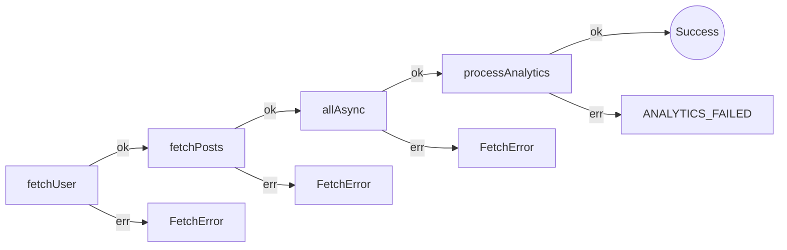
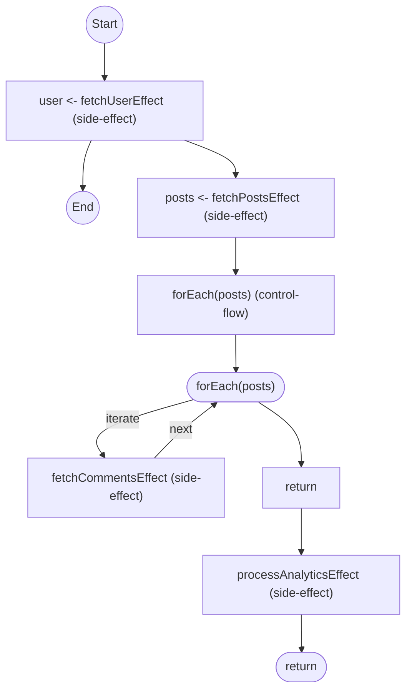

# Data pipeline: cache keys and resume

Fetch a user, their posts, comments on those posts, then analytics. Slow APIs make cache keys useful. A crash mid-run makes resume useful.

See `data-pipeline.test.ts`.

## The Approaches

### 1. Awaitly

This sample uses `createWorkflow` because the test needs step keys and resume. For Results without workflows, see [api-comparison.md §1–2](./api-comparison.md).

You pass a `key` on the step. Replay skips work that already succeeded.

```typescript
return workflow.run(async ({ step, deps }) => {
  const user = await step(
    'fetchUser',
    () => deps.fetchUser(userId),
    {
      description: 'Fetch user',
      key: `user:${userId}`, // Enables caching & resume
    }
  );
});
```

**Fits this constraint:** cache and resume are step options. Runs emit OpenTelemetry spans; `onEvent` is there if you want step logs.

**Costs:** you take `createWorkflow` (or `durable.run`) to get keys and resume. Bound keys are position-derived; a drifted resume fails with `WorkflowShapeDriftError`.

**What the analyzer sees.** `awaitly-analyze src/comparison/data-pipeline.test.ts` draws the pipeline from the source, one node per step and one `err` edge per error the dep can produce:



### 2. neverthrow

The happy path is a chain. Retry, cache, and resume are helpers you write, or `try/catch` loops inside the chain.

```typescript
return fetchUserNt(userId).andThen((user) =>
  fetchPostsNt(userId).andThen((posts) =>
    // ... nesting grows deeper ...
  )
);
```

**Fits this constraint:** you see each hop. No extra runtime.

**Costs:** cache and resume are yours. User → posts → comments → analytics nests unless you use `safeTry`.

### 3. Effect

Retries, timeouts, and concurrency limits are `Schedule` and combinators. The tests wrap comment/post fetchers with `Effect.timeout`, `Effect.mapError`, and `Effect.retry`, then join them with `Effect.all`.

**Fits this constraint:** retry and timeout are data. `Effect.all` cancels losers. Request cache dedupes in-process.

**Costs:** you learn `Effect`, `Schedule`, `yield*`, and `pipe`. Crash-resume across process death is still yours to persist. A one-off script pays for the runtime without using it.

**What the analyzer sees.** `effect-analyze src/comparison/data-pipeline.test.ts` draws `dataPipelineEffect` with the error channel of each yield in the node label. The comments fetch shows up as a loop because the code uses `Effect.forEach`; an earlier draft used `Effect.all(posts.map(...))`, which the analyzer rendered as `Effect.all (0)` and `@effect/tsgo` flagged during `tsc` with the suggestion to switch. Style lines trimmed:



### 4. Awaitly policies and durable run

Same pipeline, with circuit breaker, rate limiter, and `durable.run`:

```typescript
import { durable } from 'awaitly/durable';
import { createCircuitBreaker, circuitBreakerPresets } from 'awaitly';
import { createRateLimiter } from 'awaitly';
import { servicePolicies, withPolicy } from 'awaitly';

// Circuit breaker for flaky APIs
const apiBreaker = createCircuitBreaker('external-api', circuitBreakerPresets.standard);

// Rate limiting for external services
const rateLimiter = createRateLimiter('api', { maxPerSecond: 10 });

// Durable execution with automatic resume
const result = await durable.run(
  { fetchUser, fetchPosts, fetchComments },
  async ({ step, deps }) => {
    const user = await step(
      'fetchUser',
      () => deps.fetchUser(userId),
      withPolicy(servicePolicies.httpApi, { key: `user:${userId}` })
    );

    // Rate-limited + circuit-protected API call
    const posts = await rateLimiter.execute(() =>
      apiBreaker.executeResult(() =>
        step('fetchPosts', () => deps.fetchPosts(user.id), { key: `posts:${user.id}` })
      )
    );

    return { user, posts };
  },
  { id: `pipeline-${userId}`, store, version: 1 }
);
```

`servicePolicies`, `createCircuitBreaker`, `createRateLimiter`, and `durable.run` live in this layer. Syntax stays async/await.

Resume is the sharp edge. Replaying the wrong checkpoint feeds one step's data into another. Snapshots record executed step order; a drifted resume fails with `WorkflowShapeDriftError` in `onBeforeStep`, before the stored value is read.

## Comparison Table

| Feature | neverthrow | Effect | Awaitly |
| :--- | :--- | :--- | :--- |
| **In-process cache** | You write it | Request cache service | Step `key` |
| **Resume after crash** | You persist it | You persist it | `resumeState` / `durable.run` |
| **Tracing** | You add it | Runtime tracing / logging | OpenTelemetry spans + `onEvent` |
| **Circuit breaker** | You write it | Compose from `Schedule` / defect handling | `createCircuitBreaker` |
| **Rate limit** | You write it | `Schedule` / platform rate limiter | `createRateLimiter` |
| **Retry / timeout** | You write it | `Schedule` | `servicePolicies` / step options |
| **Parallel** | `ResultAsync.combine()` | `Effect.all()` | `allAsync()` / `step.all()` |

Streaming that pipeline (windowing vs resume-on-batch) is in [streaming.md](./streaming.md).

## Against this constraint

- **Fewest lines for cache keys plus crash-resume:** Awaitly step `key` and `durable.run`. neverthrow and Effect leave persistence to you.
- **Retry, timeout, and cancel-on-failure as one model:** Effect `Schedule` + `Effect.all`.
- **Result chain with no extra runtime:** neverthrow, if you accept writing cache and resume.
