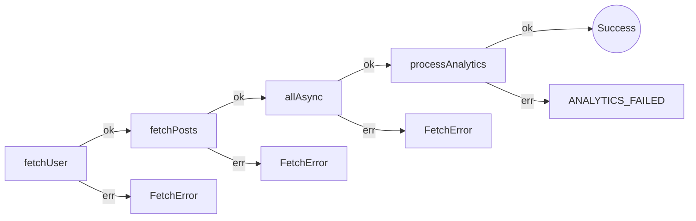

# Real-World Scenario: Data Pipeline with Caching & Resume

**Scenario:** A data pipeline that fetches a User, then their Posts, then Comments for those posts, and then processes Analytics.
**Key Constraints:** APIs are slow (need caching) and processes may be interrupted (need resume capability).

See the code: `data-pipeline.test.ts`

## The Approaches

### 1. The Awaitly Approach

*This scenario uses `createWorkflow` because the pipeline needs step caching and resume. For typed Results without workflows, see [api-comparison.md §1–2](./api-comparison.md).*

*High readability, built-in caching and resume.*

Awaitly excels here because caching and resume state are first-class features. You configure the step with a `key` rather than wrapping your logic in external helpers.

```typescript
// Built-in caching and resume
return workflow.run(async ({ step, deps }) => {
  const user = await step(
    'fetchUser',
    () => deps.fetchUser(userId),
    {
      description: 'Fetch user',
      key: `user:${userId}`, // Enables caching & resume
    }
  );
});
```

**Pros:**
- **Caching:** The `key` parameter gives you idempotency and caching, so you skip duplicate API calls.
- **Resume:** Can pause and resume the pipeline from the last successful step (using `resumeState`).
- **Observability:** runs and steps emit OpenTelemetry spans on their own since 4.5, and the `onEvent` hook is still there for step-by-step events.
- **Automatic Error Inference:** TypeScript infers the union of every error your deps produce, plus the `UnexpectedError` safety net unless you opt into strict mode.

**Cons:**
- Requires the `createWorkflow` wrapper (from `awaitly`) to get the full power of caching/inference.

**What the analyzer sees.** `awaitly-analyze src/comparison/data-pipeline.test.ts` draws the pipeline from the source, one node per step and one `err` edge per error the dep can produce:



### 2. The Neverthrow Approach
*Explicit, but requires manual helpers.*

Neverthrow handles the happy path with chains, and has no built-in retry or caching for promises. You often end up writing custom helpers or using raw `try/catch` loops inside your Result chains.

```typescript
return fetchUserNt(userId).andThen((user) =>
  fetchPostsNt(userId).andThen((posts) =>
    // ... nesting grows deeper ...
  )
);
```

**Pros:**
- **Explicit Data Flow:** You can see what data goes where.
- **No Magic:** Functions calling functions.

**Cons:**
- **No Native Caching:** You check a cache by hand before calling the function.
- **No Resume State:** You write the checkpoint/resume logic yourself.
- **Nesting:** As the pipeline grows (User -> Posts -> Comments -> Analytics), the indentation drift ("callback hell") can get real.

### 3. The Effect Approach
*Powerful policies, steep learning curve.*

Effect exists for this. It treats retries, timeouts, and concurrency limits as reusable policies that you compose around your effects. In the tests we wrap the comment/post fetchers with `Effect.timeout` + `Effect.mapError` + `Effect.retry` driven by an exponential `Schedule`, then join them via `Effect.all`.

**Pros:**
- **Policy Composition:** Retries, timeouts, and rate limits are one combinator each (`Effect.retry`, `Effect.timeout`).
- **Concurrency:** `Effect.all(..., { concurrency: 'unbounded' })` makes parallel fetching (like comments for all posts) straightforward and cancels losers on failure.
- **Request Caching:** Effect ships a request cache service if you need deduping.

**Cons:**
- **Complexity:** Requires understanding `Effect`, `Schedule`, `yield*`, and `pipe`.
- **Resume State:** Resume functionality would require custom implementation.
- **Overkill:** Might be too much "machinery" for a simple script.

**What the analyzer sees.** `effect-analyze src/comparison/data-pipeline.test.ts` draws `dataPipelineEffect` with the error channel of each yield in the node label. The comments fetch shows up as a loop because the code uses `Effect.forEach`; an earlier draft used `Effect.all(posts.map(...))`, which the analyzer rendered as `Effect.all (0)` and `@effect/tsgo` flagged during `tsc` with the suggestion to switch. Style lines trimmed:


### 4. Awaitly Advanced Features

Awaitly now provides the same production-grade reliability features as Effect, with familiar syntax:

```typescript
import { durable } from 'awaitly/durable';
import { createCircuitBreaker, circuitBreakerPresets } from 'awaitly';
import { createRateLimiter } from 'awaitly';
import { servicePolicies, withPolicy } from 'awaitly';

// Circuit breaker for flaky APIs
const apiBreaker = createCircuitBreaker('external-api', circuitBreakerPresets.standard);

// Rate limiting for external services
const rateLimiter = createRateLimiter('api', { maxPerSecond: 10 });

// Durable execution with automatic resume
const result = await durable.run(
  { fetchUser, fetchPosts, fetchComments },
  async ({ step, deps }) => {
    const user = await step(
      'fetchUser',
      () => deps.fetchUser(userId),
      withPolicy(servicePolicies.httpApi, { key: `user:${userId}` })
    );

    // Rate-limited + circuit-protected API call
    const posts = await rateLimiter.execute(() =>
      apiBreaker.executeResult(() =>
        step('fetchPosts', () => deps.fetchPosts(user.id), { key: `posts:${user.id}` })
      )
    );

    return { user, posts };
  },
  { id: `pipeline-${userId}`, store, version: 1 }
);
```

**Pros:**
- **Built-in Policies:** `servicePolicies.httpApi`, `retryPolicies`, `timeoutPolicies`
- **Circuit Breakers:** `createCircuitBreaker` with presets (critical/standard/lenient)
- **Rate Limiting:** `createRateLimiter`, `createConcurrencyLimiter`
- **Durable Execution:** `durable.run` with automatic checkpointing and resume
- **Familiar Syntax:** Still async/await, no new paradigm to learn

**Resume correctness (Awaitly 4):** a pipeline is where a bad resume hurts most, because replaying the wrong checkpoint feeds one step's data into another without complaint. Bound step keys are position-derived (`fetchPosts`, `fetchPosts#2`, …), so inserting a step used to shift every later key and your only defence was remembering to bump `version`. Snapshots now record the executed step order, and a drifted resume fails with `WorkflowShapeDriftError` instead of replaying. The check runs in `onBeforeStep`, before the stored value is read, which is the last place it can be caught: `onAfterStep` never fires for a replayed step.

## Comparison Table

| Feature | Awaitly | Neverthrow | Effect |
| :--- | :--- | :--- | :--- |
| **Caching** | Built-in (`key` param) | Manual implementation | Via Request Cache service |
| **Resume State** | Built-in (`resumeState`, `durable.run`) | Manual implementation | Manual implementation |
| **Observability** | Built-in (OpenTelemetry spans, plus `onEvent`) | Manual implementation | Runtime tracing / logging |
| **Circuit Breaker** | Built-in (`createCircuitBreaker`) | Manual implementation | Manual implementation |
| **Rate Limiting** | Built-in (`createRateLimiter`) | Manual implementation | Manual implementation |
| **Policies** | Built-in (`servicePolicies`) | Manual implementation | Via `Schedule` |
| **Parallelism** | `allAsync()`, `step.all()` | `ResultAsync.combine()` | `Effect.all()` |
| **Syntax** | Async/Await | Method Chaining | Generator (`yield*`) |
| **Readability** | High | Medium (Nesting) | High (Once learned) |

### 5. Streaming Pipeline (Awaitly 4)

For pipelines processing large datasets, `awaitly/durable` provides Result-aware stream transformers:

```typescript
import {
  durable,
  createMemoryStreamStore,
  pipe,
  map,
  filter,
  chunk,
} from 'awaitly/durable';

// durable.run takes a streamStore, so durable execution and streaming compose
// in one call, resume a long pipeline *and* stream it
const streamStore = createMemoryStreamStore();

const result = await durable.run(
  { saveBatch },
  async ({ step, deps }) => {
    const reader = step.getReadable<string>({ namespace: 'input' });

    // Data-first transformers composed with pipe(); each stage takes the source
    const batches = pipe(
      reader,
      (s) => map(s, (line) => line.trim()),
      (s) => filter(s, (line) => line.length > 0),
      (s) => chunk(s, 100) // Batch for efficient writes
    );

    // for-await is the native shape: each batch is a keyed step, so a crash
    // resumes at the batch it died on
    let total = 0;
    for await (const batch of batches) {
      await step('saveBatch', () => deps.saveBatch(batch), { key: `batch:${total}` });
      total += batch.length;
    }

    return { total };
  },
  {
    id: `pipeline-${jobId}`,
    store: durableStore,
    streamStore,
    version: 1,
    // Declaring it puts STREAM_READ_ERROR in the static union, so the switch
    // below is exhaustive rather than a runtime string comparison
    errors: ['STREAM_READ_ERROR'],
  }
);

// A failing stream is infrastructure failing, not a bug: it arrives as a typed
// value, never wrapped in UnexpectedError
if (!result.ok) {
  switch (result.error.type ?? result.error) {
    case 'STREAM_READ_ERROR':
      return { status: 503 }; // the store is down, retry later
    case 'SAVE_FAILED':
      return { status: 500 };
  }
}
```

**Key Features:**
- **Plain async iterables**: every transformer takes the source first and returns an `AsyncIterable`, so `for await` and `pipe()` both work
- **Backpressure**: Pauses upstream when downstream falls behind
- **Workflow integration**: the reader comes from the run's `streamStore`, so steps around it still cache and resume
- **Typed infrastructure failures**: a stream read failure arrives as `STREAM_READ_ERROR` in `result.error`, matched like `STEP_TIMEOUT`, while a throw from your own transform callback stays an `UnexpectedError`. Declaring it with `errors` also puts it in the static union, so TypeScript checks the boundary switch. Effect models this in the stream's error channel; here it stays in the one `result.error` union you already match on.
- **Composable**: Chain transformers like Unix pipes

**Limitations vs Effect Stream:**
- No windowing (time or count-based)
- Simpler backpressure model
- No stream merging/splitting

## Conclusion

For **Data Pipelines**:
- **Awaitly** now matches Effect's feature set for reliability (circuit breakers, rate limiting, policies, durable execution, streaming) while maintaining familiar async/await syntax. It's the best choice for teams that want production-grade reliability without learning a new paradigm.
- **Effect** remains powerful if you need structured concurrency with fiber semantics, complex stream operations, and are comfortable with functional programming.
- **Neverthrow** struggles here without extra utility libraries for caching, resume, streaming, and reliability features.
