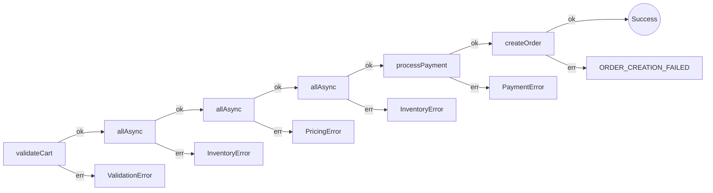

# Real-World Scenario: E-commerce Checkout

**Scenario:** A checkout flow involving Cart Validation, Inventory Checks (parallel), Pricing (parallel), Inventory Reservation, Payment, and Order Creation.
**Key Constraints:** Multiple failure points, diverse error types, need for parallel execution.

See the code: `ecommerce-checkout.test.ts`

## The Approaches

### 1. The Awaitly Approach

*This scenario uses `createWorkflow` because checkout needs parallel steps and automatic error inference. For typed Results without workflows, see [api-comparison.md §1–2](./api-comparison.md).*

*Automatic Error Unions & Flat Flow.*

The main advantage here is **Automatic Error Inference**. Checkout fails in five ways (`ValidationError`, `InventoryError`, `PricingError`, `PaymentError`, `OrderError`), and Awaitly infers that union for you.

```typescript
// Type inference works automatically
import { createWorkflow, allAsync } from 'awaitly';

const workflow = createWorkflow('checkout', { validateCart, checkInventory, getPricing, ... });

return workflow.run(async ({ step, deps }) => {
  // Parallel execution: the error type is InventoryError
  const inventoryChecks = await step(
    'checkInventory',
    () => allAsync(
      validatedCart.items.map(item =>
        deps.checkInventory(item.productId, item.quantity)
      )
    ),
    { key: `inventory:${cart.userId}` }
  );
});
```

**Awaitly 4 removed a failure mode here.** In Awaitly 3, `allAsync` caught promise rejections and reported `PromiseRejectedError`, so every caller had to widen its union and remap that case back into the domain (`isPromiseRejectedError(error) ? 'OUT_OF_STOCK' : error`), reaching for a `step.fromResult` with an `onError` mapper to launder an error nobody modelled. A rejection is a thrown exception, and `UnexpectedError` already covers those, so `allAsync` and `anyAsync` no longer report it. The parallel inventory check is now a plain `step()` whose error type is the union the deps declare.

Two related tightenings: `any` / `anyAsync` now require a non-empty array (an empty one is a compile error, and `EmptyInputError` is gone from the return type), and when every racer in `anyAsync` fails, a modelled error always wins over a thrown one instead of whichever settled first. `allSettledAsync` is unchanged, since reporting every outcome, `PromiseRejectedError` included, is what it is for.

**Pros:**
- **Type Safety without Boilerplate:** You don't need to hand-write `Result<Order, Error1 | Error2 | Error3 ...>`.
- **Flat Structure:** Async/await keeps the code linear, even with 6+ steps.
- **Early Exit:** If the cart is invalid, it stops on that line. No need to check `.isErr()` after every line.
- **Saga Pattern:** For checkout flows that need rollback (refund payment if shipping fails), Awaitly provides `createSagaWorkflow` with automatic LIFO compensation.

**What the analyzer sees.** `awaitly-analyze src/comparison/ecommerce-checkout.test.ts` reads the named `run('checkout', ...)` form and lists the three parallel `allAsync` groups in order, each with the error its deps can produce:



#### Saga Pattern for Checkout

When checkout steps need rollback on failure:

```typescript
import { createSagaWorkflow, isSagaCompensationError } from 'awaitly/durable';

const checkout = createSagaWorkflow('checkout', {
  reserveInventory,
  releaseInventory,
  chargeCard,
  refundPayment,
  scheduleShipping,
});

const result = await checkout.run(async ({ step, deps }) => {
  const reservation = await step(
    'reserveInventory',
    () => deps.reserveInventory(items),
    { compensate: (res) => deps.releaseInventory(res.id) },
  );

  const payment = await step(
    'chargeCard',
    () => deps.chargeCard(amount),
    { compensate: (p) => deps.refundPayment(p.transactionId) },
  );

  // If shipping fails, compensations run automatically in reverse order:
  // 1. refundPayment, 2. releaseInventory
  await step('scheduleShipping', () => deps.scheduleShipping(reservation.id));

  return { reservation, payment };
});
```

### 2. The Neverthrow Approach
*Explicit, but verbose.*

Neverthrow asks you to name the error union yourself, which stays clear and takes more upkeep as the flow grows. Chaining also puts earlier variables such as `cart` out of reach deep in the chain unless you thread them through each callback, which is what `safeTry` exists to solve.

```typescript
// Requires explicit error typing or loose 'any'
ResultAsync.combine([inventory, pricing])
  .andThen(([inv, price]) => {
     // access 'cart' from 2 scopes up? 
     // You often need to pass it down or nest closures.
  })
```

**Pros:**
- **Explicit:** You know what is happening at every step.
- **Functional:** Great if you prefer `pipe` style data transformations.

**Cons:**
- **Variable Scoping:** Accessing variables from 3 steps ago inside a `.andThen` callback is painful (variable shadowing or drilling).
- **Boilerplate:** Writing large Error Union types by hand.

### 3. The Effect Approach
*Powerful Concurrency.*

Effect shines in the parallel section (`Inventory` + `Pricing`). Its concurrency controls are best-in-class.

```typescript
// Powerful concurrency controls
yield* Effect.all([checkInventory, getPricing], { concurrency: 'unbounded' });
```

**Pros:**
- **Structured Concurrency:** When one parallel task fails, Effect cancels the others and frees the resources.
- **Generators:** Solves the "Variable Scoping" problem Neverthrow has (all variables in scope).

**Cons:**
- **Types:** While strong, the error types can get complex to read in tooltips.

**What the analyzer sees.** `effect-analyze src/comparison/ecommerce-checkout.test.ts` draws the fork for inventory and pricing, and each `Effect.forEach` as a loop over `validatedCart.items`. Style lines trimmed:

```mermaid
flowchart TB

  start((Start))
  end_node((End))

  n2["validatedCart <- validateCartEffect <Cart, ValidationError, never> (side-effect)"]
  n3["Effect.all (2) (concurrency)"]
  parallel_fork_4{{"All (2)"}}
  parallel_join_4{{"Join"}}
  n5["forEach(validatedCart.items) (control-flow)"]
  loop_6(["forEach(validatedCart.items)"])
  n7["checkInventoryEffect (side-effect)"]
  n8["forEach(validatedCart.items) (control-flow)"]
  loop_9(["forEach(validatedCart.items)"])
  n10["getPricingEffect (side-effect)"]
  n11["forEach(validatedCart.items) (control-flow)"]
  loop_12(["forEach(validatedCart.items)"])
  n13["reserveInventoryEffect (side-effect)"]
  n14["payment <- processPaymentEffect <( transactionId: string; ), PaymentError, never> (side-effect)"]
  n15["return"]
  term_16(["return"])
  n17["createOrderEffect <Order, 'ORDER_CREATION_FAILED', never> (side-effect)"]

  n3 --> parallel_fork_4
  n5 --> loop_6
  loop_6 -->|iterate| n7
  n7 -->|next| loop_6
  parallel_fork_4 -->|forEach(validatedCart.items)| n5
  loop_6 --> parallel_join_4
  n8 --> loop_9
  loop_9 -->|iterate| n10
  n10 -->|next| loop_9
  parallel_fork_4 -->|forEach(validatedCart.items)| n8
  loop_9 --> parallel_join_4
  n2 --> n3
  n11 --> loop_12
  loop_12 -->|iterate| n13
  n13 -->|next| loop_12
  parallel_join_4 --> n11
  loop_12 --> n14
  n15 --> n17
  n17 --> term_16
  n14 --> n15
  start --> n2
  n2 --> end_node
```

## Comparison Table

| Feature | Awaitly | Neverthrow | Effect |
| :--- | :--- | :--- | :--- |
| **Error Types** | Auto-inferred Union | Manual Union | Auto-inferred (Generic) |
| **Flow Control** | Linear (Async/Await) | Nested (Callbacks) | Linear (Generators) |
| **Variable Access**| Easy (Block Scope) | Hard (Closure Scope) | Easy (Block Scope) |
| **Parallelism** | Good | Good | Excellent (Interruption) |
| **Saga/Rollback** | Built-in (`createSagaWorkflow`) | Manual | Manual |
| **Circuit Breaker** | Built-in | Manual | Manual |

### HTTP Boundaries with Awaitly 4

Awaitly 4 has no `awaitly/fetch`. Use native `fetch` and wrap the boundary with `tryAsync`, mapping transport and status failures into the checkout domain error union. This keeps HTTP policy application-specific while preserving typed workflow errors.

## Conclusion

For **Complex Business Logic (like Checkout)**:
- **Awaitly** is the winner for **DX** and **Production Reliability**. Automatic error inference, familiar async/await syntax, built-in saga pattern for rollback scenarios, plus type-safe fetch helpers for external APIs.
- **Effect** is the winner for **Structured Concurrency**. If you need fiber-based cancellation and are comfortable with functional programming.
- **Neverthrow** is solid for simple cases but gets verbose with complex variable dependencies and lacks built-in reliability features.
