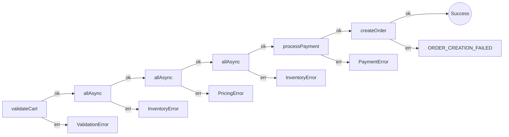

# Checkout: parallel work, five error types

Cart validation, inventory and pricing in parallel, reservation, payment, order creation. The constraint is the error union and the parallel steps, not the library.

See `ecommerce-checkout.test.ts`.

## The Approaches

### 1. Awaitly

This sample uses `createWorkflow` because the test needs named parallel steps and an inferred error union. For Results without workflows, see [api-comparison.md §1–2](./api-comparison.md).

Checkout fails as `ValidationError`, `InventoryError`, `PricingError`, `PaymentError`, or `OrderError`. `createWorkflow` infers that union from the deps object.

```typescript
import { createWorkflow, allAsync } from 'awaitly';

const workflow = createWorkflow('checkout', { validateCart, checkInventory, getPricing, ... });

return workflow.run(async ({ step, deps }) => {
  // Parallel execution: the error type is InventoryError
  const inventoryChecks = await step(
    'checkInventory',
    () => allAsync(
      validatedCart.items.map(item =>
        deps.checkInventory(item.productId, item.quantity)
      )
    ),
    { key: `inventory:${cart.userId}` }
  );
});
```


**Fits this constraint:** the error union comes from the deps object, so you skip a handwritten `Result<Order, E1 | E2 | ...>`. `step()` exits on the first `err`. `createSagaWorkflow` runs compensations LIFO if shipping fails after a charge.

**Costs:** you take a workflow wrapper to get that inference. `allAsync` no longer reports `PromiseRejectedError`; a rejection is `UnexpectedError`.

**What the analyzer sees.** `awaitly-analyze src/comparison/ecommerce-checkout.test.ts` reads the named `run('checkout', ...)` form and lists the three parallel `allAsync` groups in order, each with the error its deps can produce:



#### Saga Pattern for Checkout

When checkout steps need rollback on failure:

```typescript
import { createSagaWorkflow, isSagaCompensationError } from 'awaitly/durable';

const checkout = createSagaWorkflow('checkout', {
  reserveInventory,
  releaseInventory,
  chargeCard,
  refundPayment,
  scheduleShipping,
});

const result = await checkout.run(async ({ step, deps }) => {
  const reservation = await step(
    'reserveInventory',
    () => deps.reserveInventory(items),
    { compensate: (res) => deps.releaseInventory(res.id) },
  );

  const payment = await step(
    'chargeCard',
    () => deps.chargeCard(amount),
    { compensate: (p) => deps.refundPayment(p.transactionId) },
  );

  // If shipping fails, compensations run automatically in reverse order:
  // 1. refundPayment, 2. releaseInventory
  await step('scheduleShipping', () => deps.scheduleShipping(reservation.id));

  return { reservation, payment };
});
```

### 2. neverthrow

You name the error union. Chaining puts `cart` out of reach unless you thread it through each callback, which is why `safeTry` exists.

```typescript
// Requires explicit error typing or loose 'any'
ResultAsync.combine([inventory, pricing])
  .andThen(([inv, price]) => {
     // access 'cart' from 2 scopes up? 
     // You often need to pass it down or nest closures.
  })
```

**Fits this constraint:** every step is a visible `andThen`. You see the union because you wrote it.

**Costs:** six-step checkout nests, or you switch to `safeTry`. Parallel inventory plus pricing is `ResultAsync.combine`, with no fiber cancellation.

### 3. Effect

Inventory and pricing run together. Effect cancels the sibling when one fails.

```typescript
// Powerful concurrency controls
yield* Effect.all([checkInventory, getPricing], { concurrency: 'unbounded' });
```

**Fits this constraint:** `Effect.all` plus interruption. `Effect.gen` keeps `cart` in scope. `Schedule` is the retry/timeout policy.

**Costs:** error-channel tooltips get wide. Rollback is yours to write; there is no `createSagaWorkflow` equivalent in core.

**What the analyzer sees.** `effect-analyze src/comparison/ecommerce-checkout.test.ts` draws the fork for inventory and pricing, and each `Effect.forEach` as a loop over `validatedCart.items`. Style lines trimmed:

```mermaid
flowchart TB

  start((Start))
  end_node((End))

  n2["validatedCart <- validateCartEffect <Cart, ValidationError, never> (side-effect)"]
  n3["Effect.all (2) (concurrency)"]
  parallel_fork_4{{"All (2)"}}
  parallel_join_4{{"Join"}}
  n5["forEach(validatedCart.items) (control-flow)"]
  loop_6(["forEach(validatedCart.items)"])
  n7["checkInventoryEffect (side-effect)"]
  n8["forEach(validatedCart.items) (control-flow)"]
  loop_9(["forEach(validatedCart.items)"])
  n10["getPricingEffect (side-effect)"]
  n11["forEach(validatedCart.items) (control-flow)"]
  loop_12(["forEach(validatedCart.items)"])
  n13["reserveInventoryEffect (side-effect)"]
  n14["payment <- processPaymentEffect <( transactionId: string; ), PaymentError, never> (side-effect)"]
  n15["return"]
  term_16(["return"])
  n17["createOrderEffect <Order, 'ORDER_CREATION_FAILED', never> (side-effect)"]

  n3 --> parallel_fork_4
  n5 --> loop_6
  loop_6 -->|iterate| n7
  n7 -->|next| loop_6
  parallel_fork_4 -->|forEach(validatedCart.items)| n5
  loop_6 --> parallel_join_4
  n8 --> loop_9
  loop_9 -->|iterate| n10
  n10 -->|next| loop_9
  parallel_fork_4 -->|forEach(validatedCart.items)| n8
  loop_9 --> parallel_join_4
  n2 --> n3
  n11 --> loop_12
  loop_12 -->|iterate| n13
  n13 -->|next| loop_12
  parallel_join_4 --> n11
  loop_12 --> n14
  n15 --> n17
  n17 --> term_16
  n14 --> n15
  start --> n2
  n2 --> end_node
```

## Comparison Table

| Feature | neverthrow | Effect | Awaitly |
| :--- | :--- | :--- | :--- |
| **Error union** | You declare it | Inferred on `Effect<A, E, R>` | Inferred from deps (`createWorkflow`) |
| **Flow** | `.andThen` / `safeTry` | `Effect.gen` | async/await |
| **Earlier values** | Thread through callbacks | Block scope in `gen` | Block scope |
| **Parallel + cancel siblings** | `combine` (no interruption) | `Effect.all` with interruption | `allAsync` (no fiber cancel) |
| **Saga / rollback** | Write compensations | Write compensations | `createSagaWorkflow` |
| **Retry / timeout** | Write helpers | `Schedule` | step options / policies |

HTTP in this repo: native `fetch` wrapped with Awaitly `tryAsync`, or Effect `HttpClient`, or neverthrow `ResultAsync.fromPromise`. None of the three owns HTTP policy for you.

## Against this constraint

- **Fewest lines to keep `cart` in scope while running inventory and pricing together:** Effect `gen`, or Awaitly `async/await`. neverthrow pays in nesting or `safeTry`.
- **Sibling cancellation when one parallel check fails:** Effect.
- **Named LIFO compensations after a charge:** Awaitly `createSagaWorkflow`. The other two write the rollback by hand.
