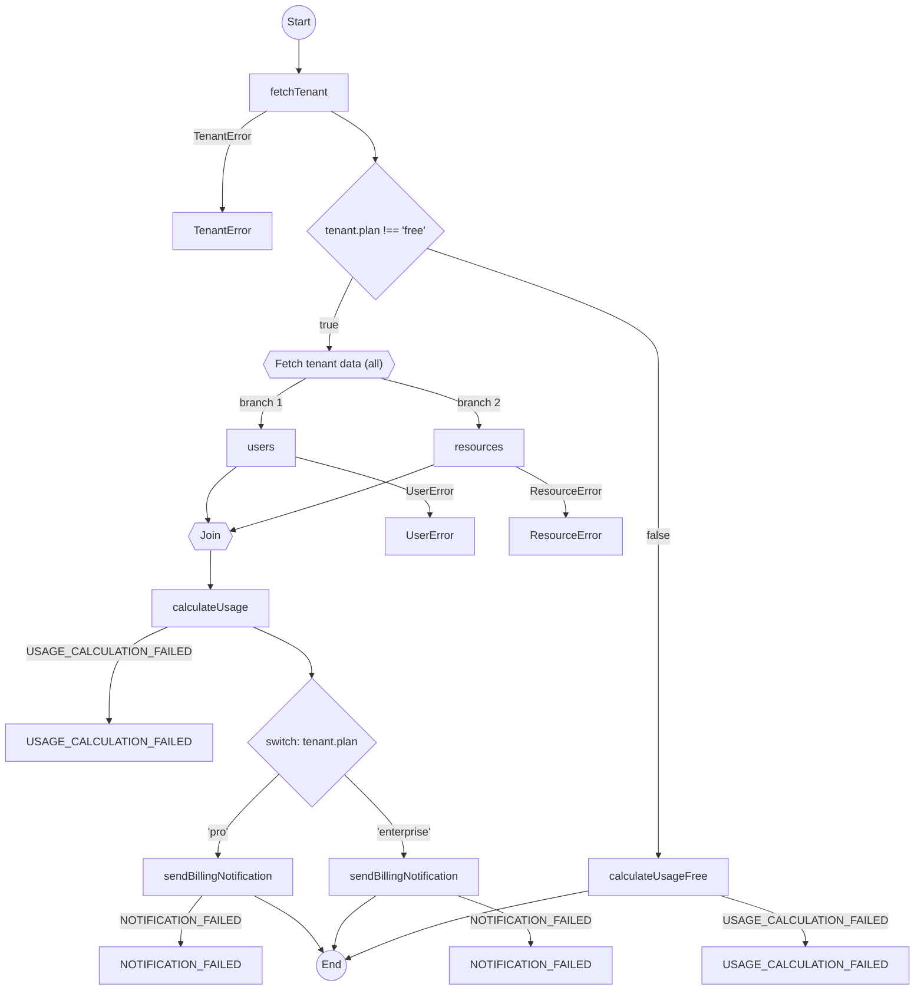

# Real-World Scenario: Multi-Tenant Workflow

**Scenario:** A SaaS workflow whose behaviour depends on the Tenant's Plan (Free vs Pro vs Enterprise).
**Key Constraints:** Conditional logic (if/else/switch), branching paths.

See the code: `multi-tenant-workflow.test.ts`

## The Approaches

### 1. The Awaitly Approach

*This scenario uses `createWorkflow` because tenant processing needs conditional steps and HITL. For typed Results without workflows, see [api-comparison.md §1–2](./api-comparison.md).*

*Plain JavaScript.*

Since Awaitly uses standard `async/await`, you can use standard JavaScript control flow statements like `if`, `else`, and `switch`.

```typescript
// It's just standard code!
return workflow.run(async ({ step, deps }) => {
  const tenant = await step('fetchTenant', () => deps.fetchTenant(tenantId), {
    description: 'Fetch tenant',
    key: `tenant:${tenantId}`,
  });

if (tenant.plan === 'free') {
  return await step(
    'calculateUsageFree',
    () => deps.calculateUsage(tenant, [], []),
    { description: 'Calculate usage (free plan)', key: `usage:${tenantId}:free` }
  );
} else {
  const { users, resources } = await step.all('Fetch tenant data', {
    users: () => deps.fetchUsers(tenantId),
    resources: () => deps.fetchResources(tenantId),
  }
  );
  
  const usage = await step(
    'calculateUsage',
    () => deps.calculateUsage(tenant, users, resources),
    { description: 'Calculate usage', key: `usage:${tenantId}` }
  );
  
  switch (tenant.plan) {
    case 'pro':
      await step('sendBillingNotification', () => deps.sendBillingNotification(tenant, usage), {
        description: 'Send pro billing notification',
        key: `notify:${tenantId}:pro`,
      });
      break;
    case 'enterprise':
      await step('sendBillingNotification', () => deps.sendBillingNotification(tenant, usage), {
        description: 'Send enterprise billing notification',
        key: `notify:${tenantId}:enterprise`,
      });
      break;
  }
  
  return usage;
});
```

**Pros:**
- **Zero Friction:** No need to learn "functional" equivalents of `if` statements.
- **Readability:** A dev new to the codebase can read this on day one.
- **Human-in-the-Loop:** For multi-tenant workflows needing approval (e.g., enterprise plan changes), Awaitly provides `createHITLOrchestrator` for pausing workflows pending human approval.

**What the analyzer sees.** Plain `if` and `switch` are diagrammable. `awaitly-analyze src/comparison/multi-tenant-workflow.test.ts` derives the branch labels from the conditions in the source, so the `'pro'` and `'enterprise'` arms and the free-plan shortcut all appear:



#### Approval Workflows for Enterprise Tenants

```typescript
import { createHITLOrchestrator, pendingApproval } from 'awaitly/durable';

const orchestrator = createHITLOrchestrator({ approvalStore, workflowStateStore });

await orchestrator.execute('plan-upgrade', workflowFactory, async ({ step, deps, args: input }) => {
  const tenant = await step('fetchTenant', () => deps.fetchTenant(input.tenantId));

  if (tenant.plan === 'enterprise' && input.newPlan === 'custom') {
    // Pause for sales team approval
    await step('pendingApproval', () => pendingApproval('Sales approval required'), {
      key: `approval:${input.tenantId}`,
    });
  }

  await step('upgradePlan', () => deps.upgradePlan(tenant, input.newPlan));
  return { success: true };
}, input);
```

### 2. The Neverthrow Approach
*Functional Conditionals.*

Neverthrow doesn't have "statements". Everything is an expression. This makes branching logic awkward. You often have to return `Result`s from inside `map` or `andThen`, leading to return type mismatches that are hard to fix.

```typescript
return fetchTenant(id).andThen(tenant => {
  if (tenant.plan === 'free') {
    return calculateFreeUsage(); // Must return same Result type!
  }
  // If 'Pro' returns a different success type, you have to normalize it.
});
```

**Pros:**
- **Expressions:** Forces you to treat code as expressions (value-oriented).

**Cons:**
- **Awkward Branching:** `if/else` inside chains often feels clunky.
- **Type Mismatches:** All branches must return compatible `Result` types, which takes some work to align by hand.

### 3. The Effect Approach
*Generators enable imperative control flow.*

Like Workflow, Effect uses generators (`yield*`), which allows using standard `if/switch` statements.

```typescript
Effect.gen(function* () {
  const tenant = yield* fetchTenant(id);
  if (tenant.plan === 'free') {
    // ...
  }
});
```

**Pros:**
- **Flexible:** Combines the power of functional programming with imperative control flow syntax.

**Cons:**
- **Setup:** Still requires the Effect boilerplate (`Effect.gen`, `runPromise`, etc.).

**What the analyzer sees.** `effect-analyze src/comparison/multi-tenant-workflow.test.ts` reads the same `if` statements out of the generator and draws the users/resources fork. Style lines trimmed:


## Comparison Table

| Feature | Awaitly | Neverthrow | Effect |
| :--- | :--- | :--- | :--- |
| **Control Flow** | Native (`if`/`switch`) | Functional (`match` / conditionals inside `map`) | Native (`if`/`switch` in gen) |
| **Branch Typing** | Automatic Union | Manual Alignment | Automatic Union |
| **Readability** | High | Low (for complex branches) | High |
| **Approval Workflows** | Built-in (HITL) | Manual | Manual |
| **Durable Execution** | Built-in | Manual | Manual |

### Rate-Limited Tenant Processing with step.sleep() (Awaitly 4)

For multi-tenant workflows that need rate limiting between API calls:

```typescript
import { createWorkflow } from 'awaitly';
import { seconds, minutes } from 'awaitly';

const processTenants = createWorkflow('processTenants', {
  fetchTenants,
  processUsage,
  sendNotification,
  syncToDataWarehouse,
});

const result = await processTenants.run(async ({ step, deps }) => {
  const tenants = await step('fetchTenants', () => deps.fetchTenants(), {
    description: 'Fetch all tenants',
    key: 'fetch-tenants',
  });

  const results = [];

  for (const tenant of tenants) {
    // Rate limit based on tenant plan
    const rateLimit = tenant.plan === 'enterprise' ? '100ms' : '1s';

    // Process tenant
    const usage = await step('processUsage', () => deps.processUsage(tenant.id), {
      description: `Process ${tenant.name}`,
      key: `usage:${tenant.id}`,
    });

    // Rate-limited notification (string duration syntax)
    await step.sleep('notify-delay', rateLimit, { key: `notify-delay:${tenant.id}` });

    await step('sendNotification', () => deps.sendNotification(tenant, usage), {
      description: `Notify ${tenant.name}`,
      key: `notify:${tenant.id}`,
    });

    // Longer delay before data warehouse sync (duration helper)
    await step.sleep('sync-delay', seconds(5), { key: `sync-delay:${tenant.id}` });

    await step('syncToDataWarehouse', () => deps.syncToDataWarehouse(tenant.id, usage), {
      description: `Sync ${tenant.name}`,
      key: `sync:${tenant.id}`,
    });

    results.push({ tenantId: tenant.id, usage });
  }

  return results;
});
```

**Key Features:**
- **Human-readable durations**: `'5s'`, `'1m 30s'`, `'2h'`
- **Duration helpers**: `seconds(5)`, `minutes(1)`, `hours(2)`
- **Caching with key**: Resumed workflows skip completed sleeps
- **Cancellation**: Supports `AbortSignal` for graceful shutdown

**Use Cases:**
- Rate limiting API calls per tenant
- Staggered batch processing
- Polling intervals with backoff
- Graceful delays before cleanup

### Result Composition for Tenant Processing (Awaitly 4)

Awaitly 4 exports Result combinators from `awaitly` and `awaitly/result`. For this multi-step tenant workflow, `run(deps, fn)` or `createWorkflow()` remains the clearest form; there is no `awaitly/functional` entry point.

## Conclusion

For **Logic with Branching (Multi-Tenant)**:
- **Awaitly** offers the best DX: imperative control flow, automatic type unions, built-in support for approval workflows (HITL), durable execution, rate limiting with `step.sleep()`, and root Result combinators.
- **Effect** offers excellent syntax via generators and powerful concurrency, but lacks built-in HITL.
- **Neverthrow** can be cumbersome here. Functional pipelines are great for linear sequences but struggle with complex branching logic.
