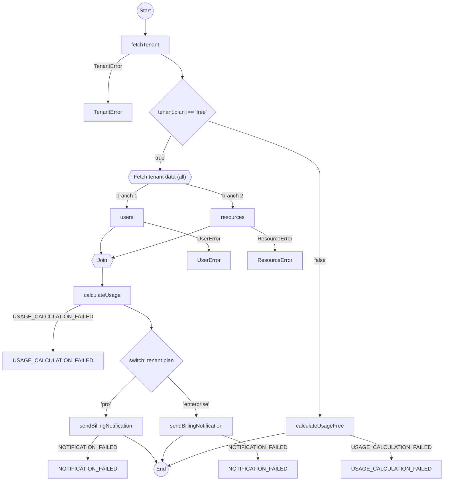

# Multi-tenant: branches on plan

Behaviour depends on Free vs Pro vs Enterprise. The constraint is `if` / `switch` on tenant state, plus optional human approval.

See `multi-tenant-workflow.test.ts`.

## The Approaches

### 1. Awaitly

This sample uses `createWorkflow` because the test needs named steps and HITL. For Results without workflows, see [api-comparison.md §1–2](./api-comparison.md).

`if`, `else`, and `switch` are ordinary JavaScript:

```typescript
return workflow.run(async ({ step, deps }) => {
  const tenant = await step('fetchTenant', () => deps.fetchTenant(tenantId), {
    description: 'Fetch tenant',
    key: `tenant:${tenantId}`,
  });

if (tenant.plan === 'free') {
  return await step(
    'calculateUsageFree',
    () => deps.calculateUsage(tenant, [], []),
    { description: 'Calculate usage (free plan)', key: `usage:${tenantId}:free` }
  );
} else {
  const { users, resources } = await step.all('Fetch tenant data', {
    users: () => deps.fetchUsers(tenantId),
    resources: () => deps.fetchResources(tenantId),
  }
  );
  
  const usage = await step(
    'calculateUsage',
    () => deps.calculateUsage(tenant, users, resources),
    { description: 'Calculate usage', key: `usage:${tenantId}` }
  );
  
  switch (tenant.plan) {
    case 'pro':
      await step('sendBillingNotification', () => deps.sendBillingNotification(tenant, usage), {
        description: 'Send pro billing notification',
        key: `notify:${tenantId}:pro`,
      });
      break;
    case 'enterprise':
      await step('sendBillingNotification', () => deps.sendBillingNotification(tenant, usage), {
        description: 'Send enterprise billing notification',
        key: `notify:${tenantId}:enterprise`,
      });
      break;
  }
  
  return usage;
});
```

**Fits this constraint:** native `if`/`switch`. `createHITLOrchestrator` pauses for approval.

**Costs:** you take a workflow wrapper. HITL is Awaitly-specific; the other two write that loop themselves.

**What the analyzer sees.** Plain `if` and `switch` are diagrammable. `awaitly-analyze src/comparison/multi-tenant-workflow.test.ts` derives the branch labels from the conditions in the source, so the `'pro'` and `'enterprise'` arms and the free-plan shortcut all appear:



#### Approval Workflows for Enterprise Tenants

```typescript
import { createHITLOrchestrator, pendingApproval } from 'awaitly/durable';

const orchestrator = createHITLOrchestrator({ approvalStore, workflowStateStore });

await orchestrator.execute('plan-upgrade', workflowFactory, async ({ step, deps, args: input }) => {
  const tenant = await step('fetchTenant', () => deps.fetchTenant(input.tenantId));

  if (tenant.plan === 'enterprise' && input.newPlan === 'custom') {
    // Pause for sales team approval
    await step('pendingApproval', () => pendingApproval('Sales approval required'), {
      key: `approval:${input.tenantId}`,
    });
  }

  await step('upgradePlan', () => deps.upgradePlan(tenant, input.newPlan));
  return { success: true };
}, input);
```

### 2. neverthrow

Chains are expressions. A branch must return the same `Result` type, so you normalize Pro vs Free by hand.

```typescript
return fetchTenant(id).andThen(tenant => {
  if (tenant.plan === 'free') {
    return calculateFreeUsage(); // Must return same Result type!
  }
  // If 'Pro' returns a different success type, you have to normalize it.
});
```

**Fits this constraint:** linear pipelines stay explicit.

**Costs:** `if` inside `andThen` must return one `Result` type. Divergent success types take extra mapping.

### 3. Effect

`Effect.gen` lets you write `if` / `switch` the same way Awaitly does, inside the generator:

```typescript
Effect.gen(function* () {
  const tenant = yield* fetchTenant(id);
  if (tenant.plan === 'free') {
    // ...
  }
});
```

**Fits this constraint:** native `if`/`switch` in `gen`. `Effect.all` for the users/resources fork.

**Costs:** you still run a generator through `Effect.runPromise`. HITL is yours to persist.

**What the analyzer sees.** `effect-analyze src/comparison/multi-tenant-workflow.test.ts` reads the same `if` statements out of the generator and draws the users/resources fork. Style lines trimmed:

```mermaid
flowchart TB

  start((Start))
  end_node((End))

  n2["tenant <- fetchTenantEffect <Tenant, TenantError, never> (side-effect)"]
  decision_4{"tenant.plan === 'free'"}
  n5["return"]
  term_6(["return"])
  n7["calculateUsageEffect <Usage, 'USAGE_CALCULATION_FAILED', never> (side-effect)"]
  n8["Effect.all (2) (concurrency)"]
  parallel_fork_9{{"All (2)"}}
  parallel_join_9{{"Join"}}
  n10["fetchUsersEffect <User(), UserError, never> (side-effect)"]
  n11["fetchResourcesEffect <Resource(), ResourceError, never> (side-effect)"]
  n12["usage <- calculateUsageEffect <Usage, 'USAGE_CALCULATION_FAILED', never> (side-effect)"]
  decision_14{"tenant.plan === 'pro' &#124;&#124; tenant.plan ===..."}
  n15["sendBillingNotificationEffect <void, 'NOTIFICATION_FAILED', never> (side-effect)"]

  n5 --> n7
  n7 --> term_6
  decision_4 -->|yes| n5
  n2 --> decision_4
  n8 --> parallel_fork_9
  parallel_fork_9 -->|fetchUsersEffect| n10
  n10 --> parallel_join_9
  parallel_fork_9 -->|fetchResourcesEffect| n11
  n11 --> parallel_join_9
  decision_4 --> n8
  parallel_join_9 --> n12
  decision_14 -->|yes| n15
  n12 --> decision_14
  start --> n2
  n15 --> end_node
  decision_14 --> end_node
```



## Comparison Table

| Feature | neverthrow | Effect | Awaitly |
| :--- | :--- | :--- | :--- |
| **Control flow** | `match` / `if` inside `map` | `if`/`switch` in `gen` | `if`/`switch` in async/await |
| **Branch types** | You align them | Inferred | Inferred from deps |
| **Human approval** | You persist it | You persist it | `createHITLOrchestrator` |
| **Delay between tenants** | `setTimeout` | `Effect.sleep` | `step.sleep` |

`step.sleep('notify-delay', '1s')` is Awaitly's delay helper with optional cache keys. Effect uses `Effect.sleep`. neverthrow uses the platform timer. See the test file for the Awaitly loop.

## Against this constraint

- **`if`/`switch` without a workflow wrapper:** Effect `gen`, or Awaitly `run` without `createWorkflow`. neverthrow pays in branch alignment.
- **Pause for a human and resume:** Awaitly HITL. The other two store that state themselves.
- **Linear Result pipeline, no branches:** neverthrow.
