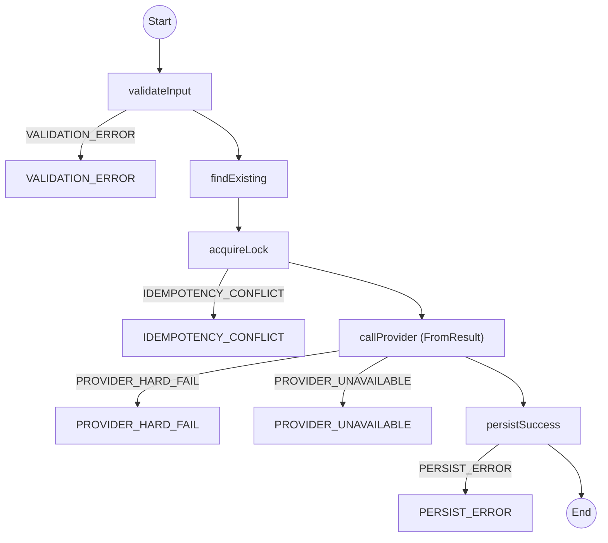
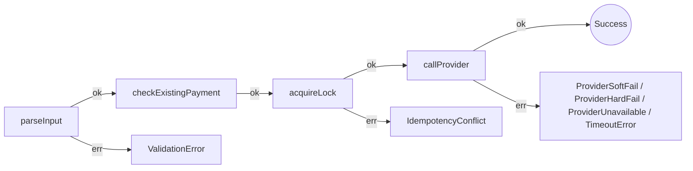
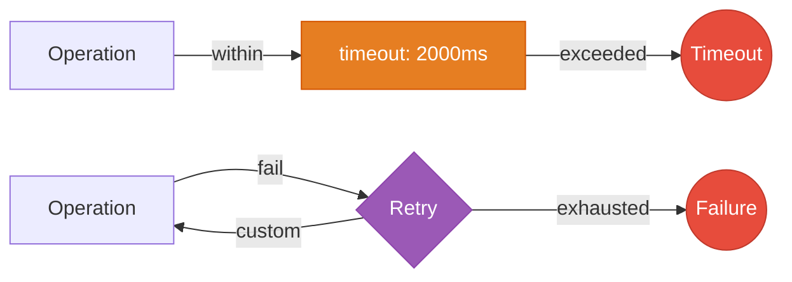

# Static analysis: Awaitly and Effect

A reviewer needs the failure paths of a payment workflow without running it. Two of the four approaches ship an analyzer that reads TypeScript and prints that.

| Tool | Package | Reads |
|------|---------|-------|
| `awaitly-analyze` | [`awaitly-analyze@0.31.0`](https://www.npmjs.com/package/awaitly-analyze) | `createWorkflow` / `run` workflows |
| `effect-analyze` | [`effect-analyzer@3.6.0`](https://www.npmjs.com/package/effect-analyzer) | `Effect.gen` programs, services, error channels, project-level lints |

Both parse with the TypeScript checker rather than running anything, so they work on a branch you have never checked out and on code that does not compile yet.

Run them here:

```bash
pnpm analyze:awaitly   # workflow diagram from src/workflow-version.test.ts
pnpm analyze:effect    # Effect diagrams from src/effect-version.test.ts
pnpm analyze:explain   # plain-English walkthrough of each Effect program
pnpm analyze:audit     # project-wide Effect coverage audit
pnpm analyze:errors    # every error type in src, and where none is handled
pnpm analyze:lint      # deterministic source lints across src
pnpm analyze:check     # CI gate: fail if a diagram is not deterministic
```

## 1. The diagram is generated from the code that runs

Hand-drawn architecture diagrams drift because they are a second artifact. The analyzer derives these from the same source the runtime executes, so a diagram that disagrees with behaviour means the analyzer is wrong, not the documentation.

`pnpm analyze:awaitly` on the payment workflow in `workflow-version.test.ts`:



Every error edge carries the error that produces it, so you can answer "what happens when the lock is already held" without opening the function body.

The analyzer also says what it cannot read. The first run of this diagram had a node labelled `Unknown: awaited call not recognized by static analysis` between `acquireLock` and `persistSuccess`, because the provider call was a bare `await deps.callProvider(...)` outside any `step`. Moving it into `step.fromResult('callProvider', ...)`, with the audit write in its `onError`, gave the diagram the two provider error edges above and the workflow a resumable step it had been missing. A diagram that omitted the node would have hidden both.

The Effect side produces the same kind of artifact from `Effect.gen`. `pnpm analyze:effect` on `createPaymentEffect` in `effect-version.test.ts`:



It also draws what each program requires from its environment, which no amount of reading the function body gives you at a glance:


And it reads policy out of the pipe. `callProvider` wraps `tryPromise` in a timeout and a retry, and the analyzer draws both:



## 2. Plain English for the reader who does not know the library

`effect-analyze --format explain` turns a program into prose. This is the output for `acquireLock` and `callProvider`, unedited:

```text
acquireLock (generator):
  1. Yields db <- DbService
  2. Yields locked <- promise
  3. If !locked:
    Returns:
      Calls fail — constructor

  Services required: DbService
  Error paths: IdempotencyConflict
  Concurrency: sequential (no parallelism)

callProvider (generator):
  1. Yields provider <- ProviderService
  2. Returns:
    Pipes tryPromise through:
      Calls tryPromise — constructor
      Times out after 2000ms
      Retries (custom)

  Services required: ProviderService
  Concurrency: sequential (no parallelism)
```

"Error paths: IdempotencyConflict" and "Concurrency: sequential" are the two facts a reviewer most often reconstructs by hand. A reader who has never written `Effect.gen` can answer what the function talks to and how it fails.

## 3. Why this matters for AI coding assistants

An assistant reading your repo has the same problem as a new engineer, made worse by a context window. It sees a slice of the file and infers the rest.

Analyzer output changes what you can put in the prompt:

- **Compressed structure.** The railway diagram for a 60-line workflow is a dozen lines and names every step, error, and branch. Pasting that costs a fraction of the source and loses none of the control flow.
- **Ground truth over inference.** An assistant asked "can this charge a customer twice?" can read `step('callProvider', ...)` with an idempotency `key` off the diagram rather than guessing from names.
- **A checkable artifact.** After an assistant edits a workflow, re-run the analyzer and diff the diagram. A step that disappeared or an error edge that vanished shows up as a structural change, even when the textual diff looks reasonable.

`--format=json` exists for this. Both tools emit machine-readable structure, including each dependency's resolved type signature:

```json
{
  "name": "validateCart",
  "typeSignature": "(cart: Cart) => AsyncResult<Cart, ValidationError>",
  "errorTypes": ["ValidationError"]
}
```

That is the type checker's answer, not a regex. An assistant handed this cannot invent an error case the deps do not produce.

Since `effect-analyzer@3.1.0` the JSON document has carried a `schemaVersion`, so a consumer that caches or diffs analyzer output can tell a format change from a code change.

## 4. Diagram drift as a CI gate

`awaitly-analyze --assert-diagrammable` exits non-zero when a workflow's diagram is not deterministic, which happens when control flow depends on something it cannot read from the source:

```bash
$ pnpm analyze:check
# dataPipeline
✓ Fully diagrammable (100/100): deterministic diagram
```

`--doctor` explains the near-misses with a fix. Running it on the multi-tenant workflow finds one:

```text
# multiTenant
✓ Workflow passes strict mode validation
  (1 warning)

⚠ [workflow-unreadable-condition]:194:4
  Conditional containing steps should use step.if() for stable IDs
  Fix: Use step.if('id', 'conditionLabel', () => condition) instead of plain if/else
```

The warning is about diagram stability rather than correctness: a plain `if` whose condition the analyzer cannot encode gives its branch no stable id, so the node moves between runs and the diff becomes noisy. The same slug appears in `eslint-plugin-awaitly`, which this repo runs through oxlint's JS plugin loader, so the editor, the analyzer, and CI use one vocabulary.

For Effect, the project-level equivalent is the coverage audit:

```bash
$ pnpm analyze:audit
Coverage audit: 11 files | Effect adoption 63.6% (7/11) | analysis success 100.0% (7/7) |
source resolution 83.04% (191/230) | failed 0 | suspicious 0
```

Adoption percentage is the useful number during a migration, and it accepts thresholds (`--min-audit-source-resolution 98`) so a partial migration can ratchet forward instead of sliding back.

## 5. Every error in the repo, in one table

`pnpm analyze:errors` reads the error channel of every Effect program under `src` and reports what can fail:

```text
# Error Channel Analysis

- Total programs: 110
- Programs with generic error: 0
- Programs with no error handlers: 52
- Programs with unhandled errors: 0

| Error Type | Count |
|------------|-------|
| `ValidationError` | 9 |
| `ProviderUnavailable` | 9 |
| `IdempotencyConflict` | 8 |
| `"NOT_FOUND"` | 7 |
| `"ANALYTICS_FAILED"` | 5 |
```

Three of those lines answer questions a reviewer would otherwise ask in a comment.

**Generic error: 0** means no program has widened its error channel to `Error` or `unknown`. That is the failure mode this whole repo is about, and the analyzer can now state it as a number rather than a claim.

**No error handlers: 52** is not a defect. A program with no handler propagates its errors to a caller that has one, which is the design in most of these files. The number is a starting point for asking where the boundary sits.

**Unhandled errors: 0** is the one to gate on. It counts errors that reach the top of a program with nothing to catch them.

The same report accepts `--format json`, so the counts can go into a dashboard or a PR comment.

## 6. What the lints found here

`pnpm analyze:lint` runs the deterministic source lints. On this repo it reports thirteen findings, all from one rule:

```json
{
  "rule": "nondeterministic-test-api",
  "severity": "warning",
  "message": "Date.now() in test code introduces non-determinism.",
  "suggestion": "Use Effect Clock/TestClock or inject a deterministic timestamp source."
}
```

Eight `Date.now()` calls, three `Math.random()` calls, and two `new Date()` calls across the scenario tests, used for ids and timestamps. They pass today because nothing asserts on the value, and they are the kind of call that turns into a flaky test the day someone does.

Both libraries in the comparison answer it the same way. Effect has `TestClock`, and awaitly ships an injectable `Clock` covering retry, sleep, timeout, and circuit breakers. The analyzer names the problem, and the fix is a constructor argument in either style. The findings stay in place here so the report has something to show.

For CI, `--lint-source` takes `--baseline <file> --fail-on-new`, which fails on findings that are new against a recorded baseline and stays quiet about the ones you have already accepted. That suits a repo adopting the lints on existing code better than a hard zero.

## What each tool is for

Both read source and emit Mermaid, and they answer different questions.

`awaitly-analyze` is built around one workflow: its steps, their cache keys, the error union, and whether a resumed run would land in the right place. It knows about idempotency because `step()` has a `key`.

`effect-analyze` is built around a program's environment: which services it requires, which errors reach the caller, where concurrency appears. It knows about services because Effect's type has an `R` channel.

It has also grown past diagrams. `--diff <base-ref>:<path> <head-ref>:<path>` renders the structural change between two git refs, which is the review question itself; `--coverage-audit` measures adoption across a directory, which suits a migration in progress; `--error-channel`, `--performance`, `--service-health`, and `--coupling` each answer one project-level question and take `--format json`; `--lint-source` carries a deterministic rule set with SARIF output, baselines, and suppression checking; and `--format json-schema --export <Name>` asks Effect itself for a schema's exact JSON Schema rather than deriving one from the AST. `--list-rules` prints the rule registry if you want to see the whole set.

Neither replaces reading the code. Both shorten the part where you work out what the code is before you can review it.

## A bug this exercise found

Pointing the analyzer at real code surfaced two defects in `awaitly-analyze@0.29.0`, both fixed in `0.29.1`.

`run` is overloaded, and the callback moves position between the two forms:

```typescript
wf.run(async ({ step, deps }) => ...);              // callback first
wf.run('checkout', async ({ step, deps }) => ...);  // callback second
```

Invocation discovery took the first argument every time, so the named form handed the analyzer a string literal. Workflows using it reported their dependencies and zero steps. `ecommerce-checkout.test.ts` uses that form, which is why its diagram was a bare `Done((Success))` while the file contained six steps.

The second defect turned the first into a silent pass: `computeDiagrammability` scored a workflow with no nodes as `100/100, deterministic: true`. `--assert-diagrammable` therefore exited 0 on every named-run workflow, and `--doctor` called the empty result diagrammable. A workflow that resolves to no nodes now reports an `empty-diagram` issue with score 0, so the gate fails and says why.

The pairing is the interesting part. A parser gap on its own produces a wrong diagram someone notices. A scorer that rates the wrong diagram perfect removes the signal that would have prompted the look. Worth remembering when you adopt any CI gate: check that it fails on something, or you have bought confidence rather than coverage.
