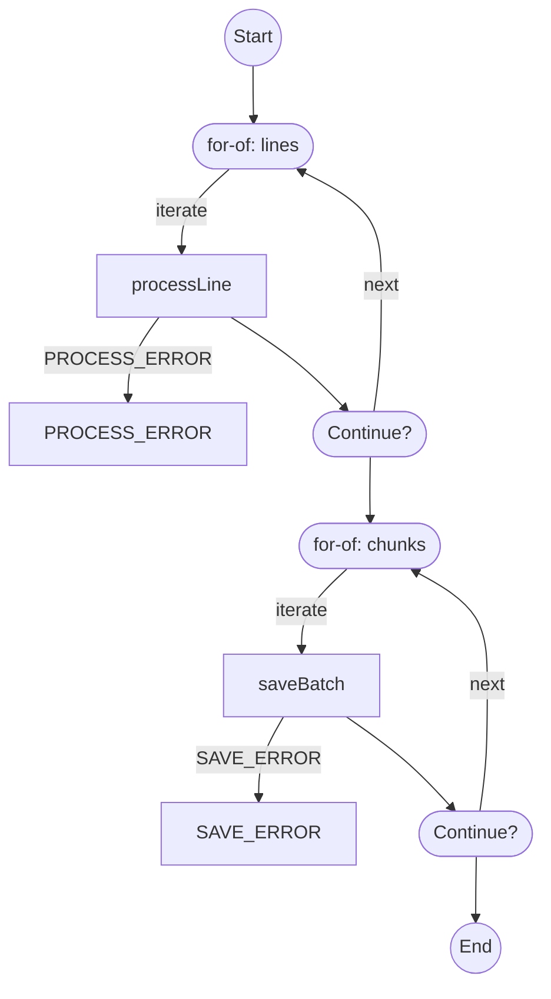

# Streaming: backpressure and error edges

Log files, CSV imports, event streams. The constraint is memory, backpressure, and how a failed item shows up.

See `streaming.test.ts`.

## The Approaches

### 1. Manual (vanilla / neverthrow)

You write the generator and the high-water mark:

```typescript
import { ok, err, Result } from 'neverthrow';

async function* processLines(
  lines: AsyncIterable<string>
): AsyncGenerator<Result<ProcessedLine, ProcessError>> {
  for await (const line of lines) {
    const parsed = parseLine(line);
    if (parsed.isErr()) {
      yield err(parsed.error);
      continue;
    }

    const validated = validateLine(parsed.value);
    if (validated.isErr()) {
      yield err(validated.error);
      continue;
    }

    yield ok(validated.value);
  }
}

// Manual backpressure handling
async function processWithBackpressure(
  source: AsyncIterable<string>,
  sink: WritableStream<ProcessedLine>,
  options: { highWaterMark: number }
) {
  const writer = sink.getWriter();
  let pending = 0;

  for await (const result of processLines(source)) {
    if (result.isErr()) {
      console.error('Processing error:', result.error);
      continue;
    }

    pending++;
    if (pending >= options.highWaterMark) {
      await writer.ready;
      pending = 0;
    }

    await writer.write(result.value);
  }

  await writer.close();
}
```

**Fits this constraint:** you control every buffer. No extra dependency.

**Costs:** you own backpressure. Composition of transformers is yours.

### 2. Effect Stream

`Stream` is part of the Effect runtime:

```typescript
import { Stream, Effect, Chunk } from 'effect';

const processLines = Stream.fromAsyncIterable(
  readLines(file),
  () => new ReadError('Failed to read')
).pipe(
  Stream.mapEffect((line) =>
    Effect.gen(function* () {
      const parsed = yield* parseLine(line);
      const validated = yield* validateLine(parsed);
      return validated;
    })
  ),
  Stream.catch((error) =>
    Stream.succeed({ error, skipped: true })
  ),
  Stream.grouped(100), // Batch into chunks of 100
  Stream.mapEffect((chunk) =>
    Effect.forEach(Chunk.toReadonlyArray(chunk), (item) =>
      saveToDatabase(item)
    )
  )
);

// Run with automatic backpressure
await Effect.runPromise(
  Stream.runDrain(processLines)
);
```

**Fits this constraint:** windowing, merge/split, interruption, backpressure in the same model as the rest of Effect.

**Costs:** you are in the Effect runtime. Bundle is large if Stream is the only reason to adopt it.

### 3. Awaitly (`awaitly/durable`)

This sample uses durable workflows because the test wants resume plus backpressure. For Results without workflows, see [api-comparison.md §1–2](./api-comparison.md).

Transformers are data-first functions over async iterables:

```typescript
import { createWorkflow } from 'awaitly';
import {
  createMemoryStreamStore,
  pipe,
  map,
  filter,
  chunk,
} from 'awaitly/durable';

// The stream store is a workflow option; step.getReadable/getWritable read it
const streamStore = createMemoryStreamStore();

const job = createWorkflow('streamJob', { parseLine, validateLine, saveBatch }, {
  streamStore,
});

const result = await job.run(async ({ step, deps }) => {
  const reader = step.getReadable<string>({ namespace: 'input' });

  // Transformers are data-first functions over an AsyncIterable, composed with
  // pipe() takes async iterables, not Web Streams TransformStreams
  const batches = pipe(
    reader,
    (s) => map(s, (line) => line.trim()),
    (s) => filter(s, (line) => line.length > 0),
    (s) => chunk(s, 100) // Batch for efficient writes
  );

  // Consume with for-await; backpressure comes from the reader's highWaterMark
  let totalProcessed = 0;
  for await (const batch of batches) {
    await step('saveBatch', () => deps.saveBatch(batch), {
      key: `batch:${totalProcessed}`,
    });
    totalProcessed += batch.length;
  }

  return { totalProcessed };
});
```

**Fits this constraint:** `for await` over async iterables. A failed read is `STREAM_READ_ERROR` on the workflow result. Step keys resume a crashed consumer.

**Costs:** no windowing, no merge/split. One backpressure strategy (high-water mark). Newer than Effect Stream.

**What the analyzer sees.** `awaitly-analyze src/comparison/streaming.test.ts` draws `streamProcess` as two `for...of` loops, one per stage, with the error each step can raise:



## Transformer Reference

Every transformer is data-first: it takes the source (a `StreamReader` or any `AsyncIterable`) as its first argument and returns an `AsyncIterable`, so `pipe(source, ...stages)` composes them and `for await` consumes them.

| Transformer | Description | Example |
|-------------|-------------|---------|
| `map(source, fn)` | Transform each item | `map(s, (x) => x * 2)` |
| `filter(source, predicate)` | Keep items matching predicate | `filter(s, (x) => x > 0)` |
| `flatMap(source, fn)` | One-to-many transformation | `flatMap(s, (x) => x.split(','))` |
| `mapAsync(source, fn)` | Async transform, yields `Result` per item | `mapAsync(s, enrich)` |
| `chunk(source, size)` | Batch items into arrays | `chunk(s, 100)` |
| `take(source, n)` / `skip(source, n)` | Limit or skip items | `take(s, 1000)` |
| `takeWhile` / `skipWhile` | Limit or skip by predicate | `takeWhile(s, (x) => x.ok)` |
| `collect(source)` | Gather all items into an array (`Promise<T[]>`) | `await collect(processed)` |
| `reduce(source, fn, init)` | Reduce to a single value | `reduce(s, (acc, x) => acc + x, 0)` |
| `pipe(source, ...stages)` | Compose the stages above | see example |

`collect` and `reduce` return plain promises, not Results: they are terminal consumers of an async iterable, and returning a Result would make every caller unwrap one to get an array.

You do not lose typed errors by that choice. The workflow boundary sorts the two failure modes. A stream failure (`STREAM_READ_ERROR` and friends) arrives as a typed value the way `STEP_TIMEOUT` does, while a throw from your own transform callback stays an `UnexpectedError` with the original on `.cause`. Declare it (`errors: ['STREAM_READ_ERROR']`) to put it in the static union; wrap with `step.try` only when you want your own callback throws typed too.

## Backpressure Handling

```typescript
import { createBackpressureController, shouldApplyBackpressure } from 'awaitly/durable';

const controller = createBackpressureController({
  highWaterMark: 1000,
  onStateChange: (state) => metrics.increment(`backpressure.${state}`),
});

for (const item of hugeDataset) {
  if (shouldApplyBackpressure(controller)) {
    await controller.waitForDrain();
  }
  await writable.write(item);
}
```

## Comparison Table

| Feature | Manual | Effect Stream | Awaitly `durable` |
|---------|--------|---------------|-------------------|
| **API** | Custom generator | Stream operators | Data-first fns over async iterables |
| **Backpressure** | You write it | Runtime | High-water mark |
| **Errors** | Your Result or throw | Effect error channel | Result + `STREAM_READ_ERROR` |
| **Windowing** | You write it | Built-in | Not supported |
| **Merge / split** | You write it | Built-in | Limited |
| **Resume with the workflow** | You persist it | You persist it | Step keys + stream store |

## Against this constraint

- **Windowing, merge, split, tunable backpressure:** Effect Stream.
- **Resume a crashed consumer without leaving async iterables:** Awaitly `durable` stream store + step keys.
- **No extra library, one file:** the manual generator. You own backpressure.
